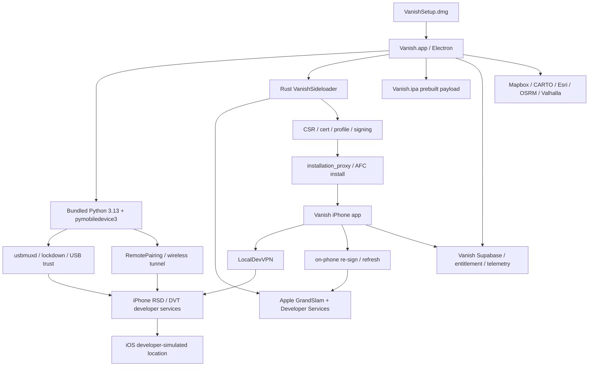

# Vanished Architecture

This document reconstructs Vanish 3.2.1 from current evidence. It separates confirmed packaging and shipped code paths from inference and untested runtime behavior.

## Executive Model

`STRONG_EVIDENCE`: Vanish is best understood as a two-mode product:

- Desktop mode: Mac Electron UI invokes bundled Python/pymobiledevice3 helpers to communicate with iPhone developer services over USB or a paired local-network tunnel.
- Mobile mode: Mac signs and installs a Vanish iPhone app, internally derived from StikDebug lineage, then the iPhone app uses LocalDevVPN, pairing, and local developer services to control location simulation without continuous Mac involvement.

`STRONG_EVIDENCE`: A local Rust helper, `VanishSideloader`, automates Apple Account sign-in, Developer Services, signing, installation, and pairing delivery.

`DISPROVEN`: Vanish does not eliminate pairing, Developer Mode, provisioning expiration, or Apple trust. It automates or hides much of that state.

## High-Level Diagram

## Component Roles

| Component | Role | Confidence | Evidence |
| --- | --- | --- | --- |
| Mac Electron app | UI, updater, orchestration, subprocess spawning, map/search UX | CONFIRMED | E02, E05, E18, E21 |
| Bundled Python | Host device services via pymobiledevice3 | CONFIRMED | E04-E06 |
| `vanish_loc_stream.py` | Retained desktop DVT location stream, GPX playback, clear | CONFIRMED | E06 |
| `VanishSideloader` | Rust helper for Apple auth, signing, install, pairing delivery | STRONG_EVIDENCE | E07-E09 |
| `Vanish.ipa` | Mobile payload installed after signing | CONFIRMED packaged payload | E12-E13 |
| LocalDevVPN | Separate iPhone helper used for local developer-service access | STRONG_EVIDENCE | E14 |
| Supabase backend | Entitlement, auth/account, telemetry, mobile session/version functions | STRONG_EVIDENCE | E20 |
| GitHub releases/Squirrel | Mac update channel | CONFIRMED | E21 |

## Lifecycle Reconstruction

### First Launch

`CONFIRMED`: The app is an Electron bundle with Squirrel/update-electron-app update logic configured for public GitHub releases. It has userData destinations for logs, saved Apple account state, sideloader state, wireless state, and identity. Evidence: E21, E22.

`UNKNOWN`: Actual first-launch network calls and update checks were not observed live.

### Device Discovery

`CONFIRMED`: Electron main code invokes bundled Python and usbmux list operations. It also contains wireless discovery/tunnel logic and AMFI/Developer Mode checks. Evidence: E05.

`STRONG_EVIDENCE`: Discovery can use standard USB trust/lockdown and local-network paired paths. Evidence: E05, E11.

`UNKNOWN`: Exact UI behavior with zero, one, or multiple devices, and whether sole-device auto-selection always occurs.

### Pairing

`CONFIRMED`: RemotePairing creation/trust, stored-record checks, pairing placement, repair, and export fallback are present. Evidence: E11.

`DISPROVEN`: "No pairing" as an architecture claim. Pairing exists and is managed.

`STRONG_EVIDENCE`: Normal user flow hides the pairing plist by creating or reusing per-device state and delivering it to the phone app.

### Apple Authentication

`STRONG_EVIDENCE`: Apple login occurs through local `VanishSideloader`, with GrandSlam/SRP, trusted-device/SMS 2FA, Xcode auth, teams, certificates, devices, App IDs, and profiles represented in the helper. Evidence: E08-E09.

`CONFIRMED`: Optional saved Apple password storage exists through Electron safeStorage in `sideload_accounts.json`. Evidence: E10.

`UNKNOWN`: Durable Apple session lifetime, exact live network destinations, and whether every login path avoids Vanish backend involvement.

### Provisioning, Signing, Installation

`STRONG_EVIDENCE`: The sideloader follows the standard Personal Team development sequence: authenticate, identify team, register device, create/reuse certificate, prepare App IDs, obtain provisioning profiles, sign payload, install. Evidence: E08-E09.

`CONFIRMED`: The intended payload is `Resources/vanish-ipa/Vanish.ipa`, despite legacy command names such as `install_sidestore`. Evidence: E09, E12.

`UNKNOWN`: Final installed bundle IDs, team IDs, entitlements, profile expiry dates, and installed profile trust behavior.

### Mobile Setup

`CONFIRMED`: `Vanish.ipa` contains a main app with source bundle ID `com.vanish.stikdebug`, display name Vanish, executable `StikDebug`, version 3.2.0, and a Live Activity extension. Evidence: E12.

`STRONG_EVIDENCE`: The phone app is provisioned by the user's Apple account rather than by the Mac publisher team. Evidence: E08-E12.

`UNKNOWN`: Exact device delta after install, because no physical before/after inventory was run.

### Spoof Initialization

`CONFIRMED`: Desktop helper imports RSD, DvtProvider, and LocationSimulation and has point, GPX, and clear operations. Evidence: E06.

`STRONG_EVIDENCE`: Mobile app uses local DVT location simulation through LocalDevVPN and pairing. Evidence: E13-E14.

`UNKNOWN`: Full readiness sequence on fresh phone, exact helper prompts, and whether mobile entitlement gates runtime commands.

### Cellular Mode

`STRONG_EVIDENCE`: Vanish mobile has a cellular flow that temporarily disables cellular, establishes a local session, then re-enables cellular. Evidence: E14-E15.

`PLAUSIBLE`: The technical issue is carrier/private-address routing collision or wrong interface selection, based on packaged handoff notes. Evidence: E15.

`UNKNOWN`: Wi-Fi to cellular, cellular to Wi-Fi, Mac-off fresh retarget, session lifetime, and carrier variability.

### Location Updates

`CONFIRMED`: Desktop point updates set latitude/longitude through DVT location simulation. Evidence: E06.

`STRONG_EVIDENCE`: Mobile has `location_simulation` and `ls_*` symbols matching DVT coordinate simulation. Evidence: E13.

`UNKNOWN`: Rich metadata such as speed, course, heading, altitude, accuracy, floor, and timestamps. Targeted searches did not identify an XCUILocation runner in the bundled IPA.

### Revert

`CONFIRMED`: Desktop helper has explicit clear and clear-on-EOF behavior. Evidence: E06.

`STRONG_EVIDENCE`: Mobile executable includes clear/stop location simulation functions. Evidence: E13.

`UNKNOWN`: Clear latency, disconnected clear, crash recovery, and whether reboot is ever needed.

### Renewal

`STRONG_EVIDENCE`: Vanish handles seven-day expiration by re-signing/reinstalling, not by bypassing Apple development signing limits. Evidence: E16.

`CONFIRMED`: Mobile symbols include `SelfRefreshInstaller` and `VanishSelfRefresh.ipa` staging. Evidence: E16.

`UNKNOWN`: Fully automatic background refresh, profile-date rollover, fully expired-app recovery, and certificate revocation behavior.

### Recovery

`CONFIRMED`: Desktop watchdog/replay, RSD identity guards, lock/reboot retry, Wi-Fi probe timing, and pairing repair paths exist. Evidence: E11, E17.

`STRONG_EVIDENCE`: Mobile has session readiness and cellular recovery UX. Evidence: E14-E17.

`UNKNOWN`: Actual success rates and recovery times, because no failure matrix was executed.

## What This Architecture Does Not Prove

- It does not prove Vanish uses a cloud command relay for coordinates.
- It does not prove Apple passwords are sent to Vanish servers.
- It does not prove cellular works cold on every device/carrier without the documented off/on bootstrap.
- It does not prove Developer Mode is unnecessary.
- It does not prove rich XCTest/XCUILocation metadata injection.
- It does not prove the Mac can be powered off for desktop-mode movement.

## Clean-Room IOSSim Implication

Most Vanish advantages are around packaging, setup automation, pairing management, recovery, refresh, and UX. Current evidence does not justify replacing IOSSim's LocalDevVPN/RPPairing/RSD/TestManager/XCTest/XCUILocation runtime. The smallest high-value path is to improve IOSSim's host device bridge, pairing orchestration, readiness/recovery model, and cellular qualification around the existing runtime.
