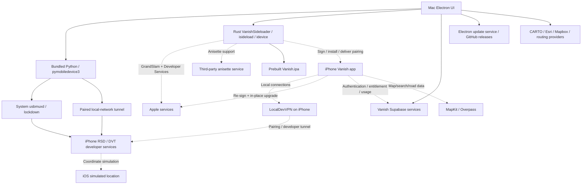

# 1. Executive Verdict

**STRONG_EVIDENCE — Vanish achieves most of its easier experience through packaging and automation around existing Apple device services. The evidence does not justify replacing IOSSim’s proven iPhone location runtime.**

The supplied product is **Vanish 3.2.1**, associated by its packaged URLs and matching public release hash with **getvanish.app** and **bhavyakhunt/vanish-releases**. The supplied name “Vanished/GetVanished” was not independently established as a separate legal entity or product. This report concerns the exact supplied DMG, not similarly named products. [E01–E03, E29; public release](https://github.com/bhavyakhunt/vanish-releases/releases/tag/v3.2.1)

Vanish contains two materially different modes. Its desktop mode uses bundled Python/pymobiledevice3 to reach iPhone developer services over USB or a paired local network. Its mobile mode installs a Swift/Rust iPhone application that uses LocalDevVPN, pairing, and local developer services. A Rust Mac sideloader automates Apple Account sign-in, signing, installation, and pairing delivery. The iPhone app contains its own re-signing and in-place refresh subsystem. [E04–E16]

The most consequential limitation: **there are no independently executed Vanish device experiments in this report.** Static forensics and public-source research were completed; the cellular, power-off, expiration, battery, and failure matrices remain explicitly untested. No isolated macOS environment or designated test iPhone was identified during this investigation. The current Mac already runs Apple development services. Vanish was not launched into that account. No Apple login, provisioning, device installation, or network disruption was performed. [E23]

| Priority question | Evidence-backed answer | Confidence |
| --- | --- | --- |
| How does it avoid full Xcode? | Bundled Python/pymobiledevice3 and Rust idevice/isideload replace user-facing Xcode device operations. Prebuilt IPA replaces end-user compilation. Developer disk images still appear required. | STRONG_EVIDENCE; packaging CONFIRMED |
| How is Apple setup automatic? | Electron invokes a local Rust helper containing GrandSlam/SRP, Developer Services, certificate, profile, signing, and install functionality. | STRONG_EVIDENCE |
| Does pairing disappear? | No. Creation, storage, placement, repair, and a manual export fallback are explicit. | “No pairing exists” DISPROVEN; automated paths CONFIRMED in shipped code |
| How does cellular work? | Mobile runtime retains a local developer session; cold startup guidance temporarily disables cellular, establishes the session, then restores cellular. | STRONG_EVIDENCE; transition reliability UNKNOWN |
| Developer Mode? | Required by the supported setup flow; the app checks/guides it. | STRONG_EVIDENCE; disabled-device experiment UNKNOWN |
| What is installed? | Intended mobile payload is Vanish, internally StikDebug, with a Live Activity widget extension; separately obtained LocalDevVPN and trust/pairing/provisioning state. | Packaged payload CONFIRMED; actual device delta UNKNOWN |
| Can the Mac power off? | Mobile mode is designed to operate locally; desktop movement requires its host runtime. Static location remaining is insufficient evidence of an active session. | Mobile independence STRONG_EVIDENCE; power-off result UNKNOWN |
| Seven days? | On-device re-signing and in-place upgrade, with Wi-Fi requirement and reminders; expiry is not abolished. | STRONG_EVIDENCE; rollover reliability UNKNOWN |
| Recovery? | Explicit desktop watchdog/replay, device identity guards, reboot/lock retry, pairing repair; mobile session and cellular recovery UI. | Shipped mechanisms CONFIRMED / STRONG_EVIDENCE; success rates UNKNOWN |
| Other friction solved? | Prebuilt payload, saved login option, automatic pairing delivery, actionable setup screens, route hold, saved places, Live Activity, update delivery. | Mixed static and public evidence; see sections 26–30 |
| Can IOSSim retain its runtime? | Yes: device bridge, pairing orchestration, readiness UI, and refresh can be developed around it. | Recommendation supported by current IOSSim structure |
| Smallest useful change set? | Finish Mac device bridge; deliver pairing automatically; qualify guided cellular/session recovery; simplify readiness and refresh UI. | MODERATE–HARD engineering; no runtime replacement needed |

Research date: 2026-09-13. IOSSim source reviewed at `0a18e986f40fd877a1aab1e91e4c6a87217c7c81`, branch `work/fix-apple-srp-503`. Its current-state document describes an older checkpoint, so historical physical results are not presented as freshly reproduced results on this HEAD. The repository was left unchanged. [E24–E28]

# 2. Top Discoveries

1. **STRONG_EVIDENCE: this is a two-mode product.** Desktop spoofing and mobile spoofing have different Mac, USB, network, provisioning, and expiration requirements. Combining them would produce incorrect architectural conclusions. [E05–E16]
2. **CONFIRMED: the device stack is bundled.** Python 3.13, pymobiledevice3 9.12.0, and an arm64 Rust sideloader are packaged. Actual Electron call sites invoke the Python device stack and native helper. [E04–E09]
3. **DISPROVEN: pairing is eliminated.** The app explicitly manages it, and its manual fallback still exposes a pairing file. [E11]
4. **STRONG_EVIDENCE: cellular is a retained-session capability with guided bootstrap restrictions.** The shipped mobile copy tells users to turn cellular off and back on. This is a directly useful IOSSim experiment. [E14–E15]
5. **STRONG_EVIDENCE: mobile re-signing happens on the phone.** Refresh packaging, AFC staging, in-place upgrade, Apple authentication code, Wi-Fi gating, and seven-day copy corroborate one another. [E16]
6. **STRONG_EVIDENCE: Vanish mobile uses DVT coordinate simulation, not an identified XCUILocation runner.** The IPA contains direct location_simulation functions and matching service selectors; no XCTest runner is packaged. [E12–E13]
7. **CONFIRMED in source: IOSSim already has substantial account/setup/recovery machinery.** A blank-slate onboarding rewrite would duplicate existing work. The Mac idevice backend, however, explicitly reports installation unavailable. [E25–E28]
8. **CONFIRMED: password persistence is an optional Mac convenience.** The saved-account implementation encrypts the Apple password with Electron safeStorage. This is different from proving durable Apple session reuse. [E10]
9. **STRONG_EVIDENCE: the cloud has several roles beyond updates.** Entitlements, account verification, usage events, ads/rewards, and mobile session accounting appear. None establishes a location-command relay. [E20, E30]
10. **CONFIRMED: the distribution is more mature than IOSSim’s documented local RC.** The enclosed Mac app is signed and accepted as notarized, and has an updater. The outer DMG itself is unsigned. [E02, E21]

# 3. Architecture Diagram

Solid connections below represent inspected package relationships or explicit shipped call paths. Dashed connections represent strongly supported mobile behavior or external requests that were not observed in a live session.

**STRONG_EVIDENCE:** there is no need to insert a Vanish location relay into this diagram to explain the observed package. **UNKNOWN:** exact mobile cloud payloads, offline entitlement policy, and whether any additional runtime path exists. [E05–E21]

# 4. Confidence Matrix

Labels describe the proposition as written, not the entire product. **CONFIRMED** means directly observed metadata or explicit shipped code structure. **STRONG_EVIDENCE** means multiple corroborating facts support a mechanism without live proof. **PLAUSIBLE** means a reasonable candidate. **UNKNOWN** means insufficient evidence. **DISPROVEN** means the stated proposition conflicts with direct evidence. A compiled function alone does not prove it runs.

| Proposition | Confidence | Basis / limit |
| --- | --- | --- |
| Supplied DMG matches public v3.2.1 asset | CONFIRMED | Local digest and release API digest identical |
| Enclosed Mac app is notarized and signature-valid | CONFIRMED | codesign and spctl |
| Outer DMG is signed | DISPROVEN | codesign reports unsigned |
| Electron, Python, Rust helper are packaged | CONFIRMED | File inventory and Mach-O metadata |
| Desktop calls bundled device-protocol stack | CONFIRMED | Executable call sites, not just strings |
| Clean consumer Mac can complete setup without Xcode | STRONG_EVIDENCE | Architecture supports it; clean-host experiment missing |
| Apple CoreDevice.framework is the bundled replacement | DISPROVEN for inspected package | No such embedded framework identified; protocol implementations present |
| Developer images become unnecessary | DISPROVEN | Auto-mount call and mobile DDI references |
| Apple auth runs in local Rust helper | STRONG_EVIDENCE | Login IPC, compiled auth, matching public library |
| Apple password is sent to Vanish backend | UNKNOWN | No evidence establishing this; local-helper path does not prove absence globally |
| Optional Mac Apple password saving exists | CONFIRMED | safeStorage code path |
| Mac durable GrandSlam session survives relaunch | UNKNOWN | Password saving and anisette state are not session-lifetime proof |
| Remote anisette support is present | CONFIRMED | Native implementation indicators and public library match |
| Particular anisette host is used in every login | UNKNOWN | Two candidate hosts; no connection trace |
| Pairing is removed | DISPROVEN | Explicit pairing creation/storage/placement |
| Ordinary setup can hide the file step | STRONG_EVIDENCE | Delivery and repair path; manual fallback remains |
| Mobile app runs local developer sessions | STRONG_EVIDENCE | IPA symbols, LocalDevVPN, pairing, DVT, public explanation |
| Mobile can cold-start seamlessly with cellular always on in the documented guided flow | DISPROVEN | Off/on instruction; universal device-specific behavior UNKNOWN |
| Mac powered off still permits fresh mobile retargets | STRONG_EVIDENCE | Local architecture; physical proof missing |
| Mac-powered-off desktop route keeps advancing | UNKNOWN | No supported mechanism identified; desktop writer is Mac-resident |
| Developer Mode is required in intended flow | STRONG_EVIDENCE | UI, checks, public guidance |
| Main mobile payload and Live Activity extension exist | CONFIRMED | ZIP and Info.plists |
| Payload contains an XCTest runner | DISPROVEN for this IPA | Complete archive inventory |
| Vanish writes rich XCUILocation metadata | UNKNOWN; evidence favors simpler writes | DVT selectors, no corresponding runner/API evidence |
| Seven-day provisioning is avoided | DISPROVEN as product strategy | Refresh explanation expressly acknowledges it |
| On-device refresh subsystem is included | CONFIRMED | Subsystem symbols, staging and upgrade functions |
| On-device refresh works through actual expiry | UNKNOWN | Not tested; expired app cannot be assumed launchable |
| Automatic recovery always works | UNKNOWN | Configured retries plus known issues, no qualification matrix |
| Backend is licensing-only | DISPROVEN as a complete description | Authentication, telemetry, reward, version, session roles |
| Backend relays spoof coordinates | UNKNOWN | Endpoint names insufficient; local mechanism better supported |
| No location-related data ever leaves either device | DISPROVEN as an absolute claim for desktop online search/routing | Search query/proximity and route-request construction |
| Vanish server stores spoof coordinates | UNKNOWN | Do not confuse third-party map requests with Vanish collection |
| Battery/CPU overhead is low | UNKNOWN | No runtime measurement |
| IOSSim can keep its current iPhone runtime while removing devicectl | STRONG_EVIDENCE | Setup/runtime separation already exists |

# 5. DMG Inventory

**CONFIRMED.** Image: `VanishSetup.dmg`, 147,766,400 bytes; SHA-256 `fef10cf9e2dcca54773f059fcbc865ad402f43637f9260c7f1391ac541c96ed0`. Format ULFO, read-only LZFSE-compressed UDIF. Its checksums passed on read-only attachment. The volume was mounted with no auto-open. [E01]

**CONFIRMED.** The outer image has no usable code signature. The app inside has a stapled notarization ticket, validates under deep/strict codesign verification, and is accepted by Gatekeeper as Notarized Developer ID. These are separate assessments; the image result does not negate the app result. Developer ID: Bhavya Khunt, team `6343MY26K5`. App signing timestamp: September 10, 2026. [E02]

| Packaged component | Size / identity | Role and confidence |
| --- | --- | --- |
| Contents/MacOS/Vanish | 69,600 bytes; arm64 Electron launcher; com.vanish.app 3.2.1 | CONFIRMED |
| Contents/Resources/app.asar | 6,581,165 bytes; 161 leaf entries | Electron main/preload/renderer, updater dependency, packaged notes; CONFIRMED |
| Resources/sideloader/VanishSideloader | 11,998,848 bytes; arm64; minimum macOS 11.0 | Native signing/device helper; CONFIRMED |
| Resources/python/bin/python3.13 | arm64 executable | Bundled interpreter; CONFIRMED |
| Resources/python/lib/libpython3.13.dylib | 19,056,640 bytes; arm64 | Interpreter library; CONFIRMED |
| Resources/python/lib/python3.13/site-packages | pymobiledevice3 9.12.0 plus dependencies | Protocol stack; CONFIRMED |
| Resources/python/vanish_loc_stream.py | Packaged Python helper | Retained desktop DVT session; explicit implementation CONFIRMED |
| Resources/python/vanish_remotepair_setup.py | Packaged Python helper | RemotePairing setup; CONFIRMED |
| Resources/python/vanish_wireless_discover.py | Packaged Python helper | Wireless discovery; CONFIRMED |
| Resources/python/vanish_wireless_tunnel.py | Packaged Python helper | RemotePairing tunnel; CONFIRMED |
| Resources/vanish-ipa/Vanish.ipa | 11,911,195 bytes; main executable 31,857,664 bytes | Intended mobile payload; CONFIRMED |
| Resources/vanish-ipa/StikDebug-2.3.7.ipa | 12,048,589 bytes | Older additional payload; presence CONFIRMED, normal installation not established |
| Frameworks/Electron Framework.framework | Executable 149,716,544 bytes; arm64 | UI/runtime; CONFIRMED |
| Frameworks/Squirrel.framework | Executable 147,104 bytes; arm64 | Updater framework; CONFIRMED |
| Frameworks/Mantle.framework; ReactiveObjC.framework | Supporting libraries | CONFIRMED |
| Vanish Helper, GPU, Renderer, Plugin apps | Electron helper bundles | CONFIRMED |

The complete generated inventory contains 4,386 regular non-symlink files under Contents, totaling 339,823,032 bytes. This total does not count ASAR internal files a second time. [E03]

No dedicated Vanish launch agent, privileged helper bundle, Network Extension, or System Extension was identified in the inspected bundle layout. **UNKNOWN:** whether runtime installation creates any additional host integration. Mac tunnel commands can request elevation without a packaged launch daemon. [E03, E05]

**CONFIRMED signing metadata:** Electron, Squirrel, Mantle, ReactiveObjC, the main Vanish Helper app, and bundled Python report Developer ID Bhavya Khunt / team `6343MY26K5`; these inspected components are thin arm64 Mach-O bundles/executables. The native sideloader is signed by the same publisher. This does not establish an Intel build or Rosetta support for the supplied image. [E02, E07, E31]

# 6. Binary / Framework Findings

**CONFIRMED:** the native sideloader links system Security, SystemConfiguration, CoreFoundation, libiconv, and libSystem. Its import table includes Keychain generic-password APIs. It does not list Xcode CoreDevice, DVT, DTDeviceKit, or MobileDevice as directly linked libraries. Statically compiled Rust paths identify idevice 0.1.65 and an isideload checkout abbreviated `3c1a008`; the matching public isideload Cargo manifest declares 0.3.17. Binary provenance may still include downstream modifications. [E07–E08; matching manifest](https://raw.githubusercontent.com/nab138/isideload/3c1a008/isideload/Cargo.toml)

**CONFIRMED entitlements:** the Mac main app and sideloader declare allow-jit, audio input, Bluetooth, camera, printing, USB, and personal-information location access. Neither inspected entitlement dictionary declares App Sandbox or a Network Extension entitlement. These broad declarations do not establish camera/microphone/Bluetooth use. The main launcher links Electron and libSystem; Squirrel links ordinary system frameworks plus Mantle/ReactiveObjC. [E31]

**CONFIRMED:** the mobile main executable has Swift/Objective-C/C/Rust metadata and links MapKit, CoreLocation, Network, Security, ActivityKit, and other system UI frameworks. It contains `_location_simulation_new`, `_location_simulation_set`, `_location_simulation_clear`, `_ls_simulate_location`, `_ls_retarget`, `_ls_stop_simulated_location`, and `_ls_location_tunnel_is_up`. The selector vocabulary matches latitude/longitude simulation and stopping that service. [E13]

**STRONG_EVIDENCE:** this supports an idevice DVT location client, especially alongside actual desktop DVT call sites and the mobile pairing/VPN subsystems. It does not establish that every compiled idevice service is used. Generic CoreDevice, RemoteXPC, certificate, and SRP strings can arise from the same linked library. [E06, E08, E13–E16]

| Requested search area | Finding | Interpretation |
| --- | --- | --- |
| CoreDevice | Protocol/service vocabulary in idevice; no embedded CoreDevice.framework found | Protocol implementation, not proof of Apple host framework loading |
| MobileDevice, DTDeviceKit, DVTFoundation, DVTDeviceFoundation, DVTiPhoneSimulatorRemoteClient | No such packaged replacement framework established | Negative limited to inspected bundle/imports |
| XCTest, XCUILocation, TestManager, testmanagerd | No matches in targeted mobile executable scan; no runner in complete IPA inventory | Do not infer an XCTest runtime for Vanish |
| RSD, RemoteXPC, RemotePairing | Helpers, symbols, call paths and plist keys | Multiple corroborating sources |
| lockdown, usbmux/usbmuxd | Explicit Python calls and native library implementation | Central host-device transport |
| installation_proxy, AFC, HouseArrest | Native helper/library evidence and mobile refresh staging | Install and app-scoped transfer likely |
| misagent | Available in public idevice stack; active Vanish use not established | UNKNOWN |
| Developer images | mounter auto-mount; mobile image/manifest/trustcache URLs | Still part of architecture |
| NetworkExtension / PacketTunnel | No such Vanish extension in IPA | Separate LocalDevVPN supplies local VPN component |
| HostID, SystemBUID, certificate/private-key plist keys | Part of standard pairing library vocabulary | Never collected actual pairing material |

No Apple development frameworks were copied or redistributed. The mobile executable references public GitHub locations for Apple developer-image assets. This identifies a likely acquisition source; it does **not** establish redistribution rights or endorse that source for IOSSim. [E14; DeveloperDiskImage project](https://github.com/doronz88/DeveloperDiskImage)

Evidence IDs throughout this report resolve in [EVIDENCE.md](EVIDENCE.md). That register supplies exact binary/archive paths and relevant line numbers. [bundle-inventory.json](bundle-inventory.json) supplies complete outer-file metadata; [asar-inventory.json](asar-inventory.json) supplies archive entry metadata. The independent inspection script is included for reproducibility and does not execute target code.

# 7. Runtime Architecture

**CONFIRMED as packaged execution paths:** Electron main starts bundled Python subprocesses and an independent Rust sideloader. The sideloader uses a command/event exchange, with distinct login, 2FA, certificate-limit, setup-step, and installation-progress events. Desktop location streaming has a long-lived Python service that accepts commands rather than starting a fresh DVT connection per point. [E05–E09]

**STRONG_EVIDENCE:** desktop mode follows Mac → usbmux/lockdown or wireless tunnel → RSD → DVT → simulated location. Mobile mode follows iPhone app → LocalDevVPN → authenticated local developer service connection → DVT location simulation. The mobile app’s signing refresh is an additional on-device workflow. [E06, E11–E16]

**UNKNOWN:** actual process trees during a user session, open listeners, privilege lifetime, sockets, CPU, and crash behavior. A process-name baseline found no Vanish process. Existing system usbmuxd and remoted were present, as was an existing CoreDeviceService; those processes cannot be attributed to Vanish. [E23]

No full credential-bearing process command lines, process memory, browser storage, or Keychain values were inspected.

# 8. Apple Account Architecture

The Mac UI sends Apple sign-in input to the local `VanishSideloader` process. Its compiled isideload stack includes GrandSlam/SRP, trusted-device verification, SMS verification, Xcode-scoped app tokens, and Developer Services. Public isideload source independently implements these mechanisms. **STRONG_EVIDENCE:** sign-in is locally orchestrated using independently implemented Apple protocols. **UNKNOWN:** the precise active transport configuration and every network hop in a real login. [E08–E10; public auth implementation](https://raw.githubusercontent.com/nab138/isideload/main/isideload/src/auth/apple_account.rs)

| Account operation | Finding | Confidence |
| --- | --- | --- |
| GrandSlam and SRP | Native implementation, Apple GsService2 lookup endpoint, proof/login messages | STRONG_EVIDENCE |
| 2FA input | Explicit UI/helper event and code submission path | CONFIRMED code path |
| Trusted-device verification | Native endpoints/errors and matching library | STRONG_EVIDENCE |
| SMS verification | Phone and security-code endpoints compiled; matching library | STRONG_EVIDENCE for capability; exact Vanish SMS selector UI UNKNOWN |
| Developer Services authorization | xcode.auth token and service endpoints | STRONG_EVIDENCE |
| Personal Team selection | Team discovery and free-account product flow | STRONG_EVIDENCE; multi-team policy UNKNOWN |
| Session reuse within helper lifetime | Stateful helper reports logged-in account | STRONG_EVIDENCE |
| Durable Apple session reuse across relaunch | Not independently established | UNKNOWN |
| Avoid repeated password typing | Optional encrypted saved-password path exists | CONFIRMED |
| Avoid all future 2FA | Not established; Apple can challenge again | UNKNOWN |

**CONFIRMED:** if the user chooses saving, Electron safeStorage encrypts the Apple password, stores an encrypted blob alongside the account identifier, and decrypts it locally for a subsequent helper login. The file is `sideload_accounts.json` under Electron userData. No contents were accessed. This convenience is not evidence that Vanish stores only session tokens, nor that it never stores passwords. [E10]

**STRONG_EVIDENCE:** remote anisette support is part of the authentication architecture. The binary contains `ani.sidestore.io` and `ani.stikstore.app`; the matching public library includes a RemoteV3 provider that obtains authentication-support headers from a remote service. That operation is distinct from sending an Apple password to a Vanish credential relay. Actual selected endpoint, payloads, and fallback behavior remain **UNKNOWN** without legitimate runtime metadata. [E08; matching anisette implementation](https://raw.githubusercontent.com/nab138/isideload/3c1a008/isideload/src/anisette/remote_v3/mod.rs)

**Recommendation:** retain IOSSim’s existing native Apple auth and Keychain session design. Do not replace it with password persistence or a public anisette service merely to imitate Vanish. Add better saved-session status and actionable reauthentication around what IOSSim already implements. [E27]

# 9. No-Xcode Architecture

**STRONG_EVIDENCE — Vanish replaces Xcode’s host orchestration with packaged protocol clients, while continuing to use Apple services on the phone.**

The desktop app explicitly invokes bundled pymobiledevice3 for usbmux discovery, Developer Mode checks, developer-image mounting, and developer tunnels. It calls its Rust helper for signing and mobile installation. The mobile IPA is already compiled. No consumer build step is needed. This accounts for the absence of a full-Xcode setup requirement without assuming hidden magic. [E04–E09]

**CONFIRMED distinction:** “CoreDevice-like protocol support” is not “bundled CoreDevice.framework.” idevice independently speaks lockdown, usbmuxd, RSD and modern device services. Its public feature list includes installation_proxy, HouseArrest, developer images, DVT and XCTest support, although a consumer must validate exactly the functions it uses. [E08; idevice](https://github.com/jkcoxson/idevice)

**STRONG_EVIDENCE:** macOS still supplies system usbmuxd and ordinary security/network libraries. Vanish’s independent clients do not eliminate Apple’s USB trust, Developer Mode, development signing, or personalized developer-image requirements. The app’s `mounter auto-mount` call and phone-side image references directly contradict that stronger interpretation. [E05, E07, E14]

**UNKNOWN:** successful first use on a clean Mac with neither Xcode nor historical CoreDevice/DDI/pairing state. This host cannot prove that claim because it already has development services. A clean-host qualification must explicitly exclude cached Apple development components, not merely avoid opening Xcode. [E23]

The practical answer for IOSSim is to replace its **Mac device-operation layer**, ship its own prebuilt artifacts, and qualify lawful developer-image acquisition. Preserve its iPhone RSD/TestManager/XCTest/XCUILocation chain.

# 10. Provisioning and Signing

**STRONG_EVIDENCE:** the sideloader implements the usual Personal Team sequence: authenticate → discover team → register/reuse device → create/reuse certificate → prepare App IDs → obtain profiles → sign payload → install. This is supported by actual install dispatch plus detailed native operation vocabulary and public isideload structure. No Apple account changes were made to validate it. [E08–E09]

| Operation | Static evidence | Confidence / limit |
| --- | --- | --- |
| CSR generation | CSR generation and submitDevelopmentCSR paths | STRONG_EVIDENCE |
| Certificate creation | submitDevelopmentCSR and certificate lookup | STRONG_EVIDENCE |
| Certificate reuse | Existing-key/storage messages | STRONG_EVIDENCE; actual reuse policy UNKNOWN |
| Certificate limit | Explicit max_certs event and user response | CONFIRMED control path; selection/revocation results UNKNOWN |
| Device registration | addDevice / listDevices | STRONG_EVIDENCE |
| App IDs | App-ID enumeration/preparation and bundle identifier modification | STRONG_EVIDENCE |
| Profiles | downloadTeamProvisioningProfile and signing workflow | STRONG_EVIDENCE |
| Native signing | isideload signing implementation; no Xcode signing subprocess identified in consumer dispatch | STRONG_EVIDENCE |
| Keychain identity | Generic Keychain API imports; PKCS#12 handling vocabulary | Storage integration supported; exact SecIdentity/key residency UNKNOWN |
| Installation | install IPC, native installation_proxy and progress support | STRONG_EVIDENCE |

The Mac Developer ID team `6343MY26K5` is the **publisher’s Mac signing identity**, not proof that an installed iPhone app uses that team. The mobile IPA is an input for user-account signing. Its pre-install bundle identifier is not necessarily its final provisioned identifier. [E02, E08, E12]

**UNKNOWN:** exact generated bundle-ID algorithm, team-selection policy, installed profile dates, actual certificate count, key export policy, and whether an account with conflicting IDs is repaired automatically. Presence of general library error handling cannot answer those questions.

# 11. iPhone Installation

**CONFIRMED packaged facts:** `Vanish.ipa` contains `Payload/StikDebug.app`, display name Vanish, executable StikDebug, source bundle ID `com.vanish.stikdebug`, version 3.2.0, and a `VanishLiveActivityExtension.appex` with source ID `com.vanish.stikdebug.liveactivity`. Its declared minimum OS is 17.4. The Mac UI separately states iOS 18+ for its supported flow; a deployment target is not a support guarantee. [E12, E19]

The complete inspected IPA inventory has no embedded provisioning profile, XCTest runner, `.xctest` bundle, bundled Apple framework, or Packet Tunnel extension. **CONFIRMED for this archive only.** The separate StikDebug 2.3.7 IPA includes a different widget; its presence does not prove the installer installs both apps. The normal install dispatch resolves `Vanish.ipa`. [E09, E12]

**STRONG_EVIDENCE intended device changes:** a development-signed Vanish app and extension; Apple developer-profile trust; app provisioning; pairing data placed into the app; local developer-image readiness; a separately installed LocalDevVPN helper and its user-approved VPN configuration. The mobile Info.plist advertises LocalDevVPN interaction and background audio/location/fetch/notification modes. [E11–E16]

**UNKNOWN:** actual before/after device inventory, final signed identifiers/entitlements, provisioning expiry, configuration-profile contents, whether a user’s existing helper is reused, and any additional downloaded runtime artifacts. No private user data was inspected.

# 12. Pairing Architecture

**DISPROVEN: Vanish eliminates pairing.** Its shipped Mac implementation creates RemotePairing trust, queries stored RPPairing per device, places pairing into installed apps, repairs it, and exposes an export fallback. The renderer even includes an error for successful installation followed by failed pairing placement. [E09–E11]

Keep two trust layers separate. Standard USB lockdown pairing establishes the normal host relationship and supports installation and services. RemotePairing authorizes the modern developer-tunnel path. Successful USB Trust does not by itself prove a valid RPPairing record exists. The package contains both mechanisms. [E05, E08, E11]

**STRONG_EVIDENCE:** mobile onboarding hides routine file handling by delivering required state automatically through a trusted device connection. Native references to AFC/HouseArrest and pairing destination filenames corroborate that delivery mechanism. The precise record transformation and selected store are not established from metadata alone. Do not describe the process as deriving a usable credential without Apple-approved pairing. [E08, E11]

Desktop wireless state refers to `~/.pymobiledevice3`, while the Rust helper has per-device RPPairing storage. Mobile filename markers include `rp_pairing_file.plist` and `pairingFile.plist`. These are **CONFIRMED static destinations/keys**, not evidence that real records were read. [E11, E22]

**UNKNOWN:** Keychain versus file storage for every pairing layer; exact permissions; survival after reset/update; whether stale records are validated before reuse in all paths. The manual fallback means the file step has not disappeared in every failure case.

# 13. Cellular Architecture

**STRONG_EVIDENCE:** Vanish Mobile keeps a developer location session on the phone and retargets it through LocalDevVPN. Startup on cellular may require a guided interruption of cellular data. The binary’s user-facing text, dedicated cellular-flow type, session-retarget function, and packaged developer notes converge on this model. [E13–E15]

The documented sequence is: ensure LocalDevVPN is active → temporarily disable cellular → establish the local session and set location → re-enable cellular → use the retained session for subsequent moves. It does not imply sending commands through the public internet to an inbound iPhone port. [E14–E15]

**PLAUSIBLE technical cause:** carrier routing overlaps the helper’s private address space, and a reachability probe can receive a response that does not demonstrate a usable local developer connection. Packaged notes attribute particular failures to this situation and to matching the wrong VPN interface address. Without a local routing/packet experiment, the carrier explanation remains a vendor-authored diagnosis, not independently confirmed fact. [E15]

| Candidate architecture | Assessment |
| --- | --- |
| 1. Mac connected by USB while iPhone uses cellular | PLAUSIBLE for desktop mode; does not explain mobile independence |
| 2. Mac-to-phone local VPN/tunnel valid on cellular | Local-network desktop path exists, but cellular WAN reachability not established |
| 3. Phone maintains local session | STRONG_EVIDENCE for mobile mode |
| 4. Phone gets location commands from Vanish internet service | UNKNOWN; not needed to explain inspected runtime |
| 5. Mac communicates through Vanish relay | UNKNOWN; no supporting command-relay evidence |
| 6. Simulator installed/run on iPhone after setup | STRONG_EVIDENCE; consistent with 3 |
| 7. Merely sticky last location after disconnect | PLAUSIBLE for apparent static persistence; cannot explain new retargets without a writer |

The decisive experiment is a **fresh location change or advancing route after Mac shutdown**, followed by local clear, not simply observing the same old coordinate. All requested transitions remain NOT_RUN; section 38 supplies the full recording matrix.

# 14. Mac Independence

**STRONG_EVIDENCE:** the mobile package has everything expected for local session control and in-place signing refresh. It is designed to free the user from a continuously running Mac. That capability is compatible with IOSSim’s existing architecture. [E13–E16, E28]

**STRONG_EVIDENCE:** the desktop route writer is a Mac Python process. Killing or powering off the Mac prevents that process from computing and sending further updates. **UNKNOWN:** when iOS clears the last injected location, whether it persists temporarily, and whether a separately active mobile writer takes over. [E06]

| Mac event | Desktop writer | Mobile architecture expectation | Measured result |
| --- | --- | --- | --- |
| Normal app quit | Cleanup/clear paths exist | Local phone writer should be separate | UNKNOWN |
| Force kill | Host writer terminates; cleanup not assured | Should not intrinsically terminate phone writer | UNKNOWN |
| Sleep | Host execution/transport may suspend | Phone session should remain local | UNKNOWN |
| Wi-Fi off | USB might remain; wireless host path affected | No direct dependency on Mac Wi-Fi expected | UNKNOWN |
| Internet off | Licensing/maps may be affected separately | Cloud policy and local session must be distinguished | UNKNOWN |
| USB removed | Desktop requires viable alternative connection | Initial mobile setup should be complete already | UNKNOWN |
| Power off | No Mac-generated future updates | Fresh phone-side retarget is decisive | UNKNOWN |

These expectations are experiment hypotheses, not passed results.

# 15. Developer Mode

**STRONG_EVIDENCE: Vanish requires Developer Mode for its intended developer-service flow.** The Mac app calls AMFI status/reveal functionality, its UI instructs the user to enable Developer Mode, and public release notes describe post-install guidance. Over Wi-Fi it may ask the user to confirm because it cannot reliably check the status. [E05, E19; v3.1 release](https://github.com/bhavyakhunt/vanish-releases/releases/tag/v3.1.0)

**CONFIRMED platform constraint:** Apple documents Developer Mode as a user-controlled prerequisite for running development-signed apps in the relevant installation scenarios. Enabling it includes a restart and confirmation; initiating pairing can make the setting visible. Revealing the setting is not equivalent to enabling it. [Apple Developer Mode documentation](https://developer.apple.com/documentation/xcode/enabling-developer-mode-on-a-device)

**UNKNOWN experiments:** fresh device with mode disabled; exact initial prompt timing; launch refusal; simulator behavior without mode; repeat setup after disabling it. No evidence supports an Apple security bypass or a Developer Mode-free location technique here.

# 16. USB Requirements

**STRONG_EVIDENCE:** USB is the initial mobile setup path for device selection, normal trust, installation, and automatic pairing delivery. The public tutorial describes a one-time cable setup, but its expiry and pairing-fallback guidance also allows later computer recovery. Do not convert “one-time setup” into an unconditional lifetime guarantee. [E09–E12, E30; tutorial](https://getvanish.app/tutorial)

**CONFIRMED code capability:** desktop Wi-Fi setup enables wireless connections, obtains RemotePairing trust, stores device-specific state, and browses for a known device. This establishes a local-network reconnection implementation, not internet or cellular reachability. [E05, E11, E17]

**UNKNOWN:** USB-free fresh setup, multiple-network roaming without intervention, every-launch requirements, and recovery on a replacement phone. Mobile cold-start cellular guidance is covered in section 13. If signing lapses completely or pairing becomes unusable, a Mac/cable recovery may again be necessary.

# 17. Seven-Day / Certificate Renewal

**STRONG_EVIDENCE — Vanish refreshes development signing rather than defeating expiration.** Mobile UI text expressly describes re-signing every seven days, labels it free and separate from payment, and requires Wi-Fi. Public tutorial text says an app that has fully stopped opening needs computer installation again. [E16, E30]

The mobile executable contains `SelfRefreshInstaller` functions for staging a copy, packaging an IPA, staging over AFC, checking/reconciling bundle identifiers, and upgrading in place. It also contains Apple-account/isideload code and an explicit staging destination for `VanishSelfRefresh.ipa`. Together these are much stronger than a lone “refresh” string. [E16]

| Renewal question | Finding | Confidence |
| --- | --- | --- |
| Personal Team seven-day window acknowledged? | Yes | CONFIRMED shipped copy |
| On-device refresh intended? | Yes | STRONG_EVIDENCE |
| Reinstall rather than toggle a date? | Signing/package/upgrade machinery | STRONG_EVIDENCE |
| User data survives? | In-place upgrade design supports it | PLAUSIBLE; actual continuity UNKNOWN |
| Apple login remembered on phone? | UI describes Keychain-backed remembered login; signing code present | STRONG_EVIDENCE; exact stored secret type UNKNOWN |
| Fully automatic background renewal? | Reminders/background declarations do not prove it | UNKNOWN |
| Refresh while cellular active? | UI requires Wi-Fi | STRONG_EVIDENCE restriction |
| App already expired? | Computer reinstall is documented recovery | STRONG_EVIDENCE |
| Certificate expiry/revocation self-heals? | Library supports certificate creation/reuse/limit handling | UNKNOWN actual recovery |

A seven-day **provisioning profile validity** must not be conflated with the certificate’s own validity interval, Apple session lifetime, or a paid Vanish entitlement. No installed profile dates were obtained, so actual start/end timestamps cannot be supplied. [E12, E16]

# 18. Persistence

**CONFIRMED storage design:** Mac account preferences, license identity, wireless configuration, and logs reside outside the app bundle; RemotePairing state also uses a separate store. Mobile recents, saved places, pairing, and refresh subsystems are present. This supports persistence across ordinary launches without proving state survives every update. [E10–E11, E19, E22]

| State | Expected lifetime / design | Evidence status |
| --- | --- | --- |
| Mac saved Apple login | Encrypted optional local saved credential | CONFIRMED code; use after reboot UNKNOWN |
| Mac Apple session | Helper state; possible library persistence | UNKNOWN across relaunch |
| USB trust | Standard trusted-host relationship | STRONG_EVIDENCE; lifetime test missing |
| RemotePairing | Per-device stored credential and repair | STRONG_EVIDENCE; invalidation behavior UNKNOWN |
| Active desktop point/route | In-memory last command used for recovery | CONFIRMED code; restart restoration UNKNOWN |
| Mobile active session | Retained local connection | STRONG_EVIDENCE; sleep/lock duration UNKNOWN |
| Developer image after phone reboot | Preparation/remount path exists | STRONG_EVIDENCE; successful remount UNKNOWN |
| Free-signed app | Requires refresh before validity expires | STRONG_EVIDENCE |

**UNKNOWN:** Wi-Fi A→B, airplane-mode recovery, hotspot changes, iPhone reboot restoration, and resume after app termination. The packaged notes themselves contain both reported successes and remaining unverified cases; their contradictions are not resolved by assuming the most favorable paragraph. [E15]

# 19. Recovery and Self-Healing

**CONFIRMED desktop mechanisms:** a location-helper watchdog respawns after an unexpected exit; it reasserts the last point or GPX route only while the RSD address/port still match; it makes at most three attempts with a two-second inter-attempt delay. Other code handles locked-device retry, reboot grace, Wi-Fi discovery retry, and explicit pairing repair. These are configured behaviors, not measured recovery times. [E17]

**STRONG_EVIDENCE mobile mechanisms:** dedicated cellular readiness flow, helper launch/return handling, retained-session retargeting, developer-image preparation, connection-loss presentation, and pairing repair guidance. The public v3.2 notes advertise improved connection handling, while packaged notes acknowledge delayed dead-tunnel detection and an occasional second-tap requirement. [E14–E17; v3.2 release](https://github.com/bhavyakhunt/vanish-releases/releases/tag/v3.2.0)

| Failure | Supported handling | What remains unknown |
| --- | --- | --- |
| USB absent | Detection and actionable reconnect guidance | Recovery latency and route continuation |
| Phone locked | Specific status and retry | Lock-state coverage on every transport |
| Missing trust | Trust guidance and pairing operations | Fresh-phone prompt sequence |
| Missing Developer Mode | Check/reveal/guidance | Disabled-mode end-to-end behavior |
| Stale pairing | Dedicated repair command and fallback export | Record validation and repair reliability |
| DVT helper crash | Watchdog and last-command replay | iOS state during the gap |
| Mobile local tunnel absent | Helper/cellular card | Reliable one-tap recovery |
| Apple outage | Auth error classification/sign-in patch | Retry behavior under all server responses |
| Certificate/profile failure | Compiled error handling | Automatic certificate/profile repair is not proven |

**UNKNOWN:** complete durable setup checkpoint model across authentication, registration, provisioning, installation, pairing, and runtime initialization. Progress events and saved data do not by themselves prove transactional resumption after interruption.

# 20. Location Simulation Technique

**CONFIRMED desktop call path:** the Python location helper opens RSD, then a DvtProvider and LocationSimulation service; point commands call the latitude/longitude setter, route commands play GPX, and clear commands invoke clear. [E06]

**STRONG_EVIDENCE mobile technique:** idevice’s DVT location simulation, reached through the phone’s local paired developer connection. The native symbols and `simulateLocationWithLatitude:longitude:` / `stopLocationSimulation` vocabulary agree with the public idevice implementation. No XCTest runner is packaged, and the targeted binary scan found no XCUILocation/XCTest/testmanagerd evidence. This is evidence against assigning IOSSim’s exact rich runtime to Vanish, not proof that all unseen runtime behavior is impossible. [E12–E14; public DVT implementation](https://raw.githubusercontent.com/jkcoxson/idevice/master/idevice/src/services/dvt/location_simulation.rs)

**STRONG_EVIDENCE intended effect:** changing the system developer-simulated location seen by CoreLocation clients. **UNKNOWN independently:** Apple Maps, browser geolocation, Weather, and third-party-app observations; per-app caching; timing; whether every app uses the same source. A simulated coordinate is not proof that all network, cell, Wi-Fi, or account-derived location signals change.

For IOSSim, keep the existing LocalDevVPN → RPPairing → RSD → DVT/TestManager → XCTest → XCUILocation chain. Vanish’s likely simpler coordinate setter is not a reason to discard rich metadata, proven session behavior, or single-writer protection. [E28]

# 21. Rich Location / Drive

**CONFIRMED desktop implementation; STRONG_EVIDENCE mobile implementation:** movement can be produced by sending a sequence of coordinate pairs. A speed control can change the distance between successive points without setting the speed field of a CLLocation. Do not equate those capabilities. [E06, E13, E19]

| Feature | Vanish evidence / confidence | IOSSim implication |
| --- | --- | --- |
| Teleport | Explicit desktop setter; mobile setter symbols: CONFIRMED / STRONG_EVIDENCE | Already present |
| Drive / planned route | Desktop GPX playback and routing; mobile route UI: STRONG_EVIDENCE | Preserve Rich Drive |
| Speed adjustment / road-limit speed | Mobile UI and release notes: STRONG_EVIDENCE | Useful route-planning option, separate from injected speed |
| Walk preset / realistic variation | UNKNOWN | Do not claim parity or superiority |
| Multi-point route / waypoints | Route geometry confirmed; arbitrary user waypoint editor UNKNOWN | Qualify independently |
| Pauses / pause-resume | Route stopping and hold supported; exact resumable progression UNKNOWN | IOSSim already has explicit pause/resume |
| Stop & Hold / destination hold | Mobile behavior described: STRONG_EVIDENCE | Already in IOSSim |
| Live planning while spoof remains active | Public v3.1 notes: STRONG_EVIDENCE | Separate draft route from active session |
| Scheduled destination | Mobile UI and release notes: STRONG_EVIDENCE | Optional UX extension |
| GPX | Desktop playback CONFIRMED; user-facing import/export completeness UNKNOWN | Do not infer export from gpxpy |
| Loops / route restart / joystick | UNKNOWN | Not established differentiators |
| Latitude / longitude | CONFIRMED desktop, STRONG_EVIDENCE mobile | Already present |
| Injected speed / course / heading | UNKNOWN; inspected setters favor coordinate-only | Preserve IOSSim rich fields |
| Injected altitude / accuracy / floor / timestamps | UNKNOWN | CoreLocation imports are not setter evidence |
| Live Activity | Packaged widget CONFIRMED; live rendering UNKNOWN | Independently implementable status convenience |

The mobile heading delegate may read compass data; it does not establish injected heading. Route speed must be tested using a user-owned CoreLocation witness app that records delivered location metadata, not the route animation. [E13; release notes](https://github.com/bhavyakhunt/vanish-releases/releases/tag/v3.1.0)

# 22. Revert Architecture

**CONFIRMED desktop:** the location helper has an explicit clear operation and clears when its input reaches EOF. Normal app quit clears remembered commands and tears down the stream/tunnel. **STRONG_EVIDENCE mobile:** clear/stop functions and DVT stop selector are present. This is an explicit developer-simulation clear design, not simply moving back to the starting coordinate. [E06, E13, E17]

**UNKNOWN:** elapsed time until fresh real GPS, behavior when the transport is already disconnected, recovery after force-kill, and whether the phone ever needs a reboot. A normal-quit cleanup path does not guarantee cleanup after power loss. “Stop route and hold” must remain separate from “restore real location.”

Recommendation: IOSSim should distinguish requested clear, transport acknowledgment, and independently observed return to real location. Persist a pending-clear intent when disconnected; give it priority over route replay on reconnect. Do not display “real location restored” solely because the local process stopped. This is a MODERATE reliability extension around the existing clear operation, not a replacement runtime.

# 23. Network / Cloud Infrastructure

**CONFIRMED static destinations, not captured traffic.** No live IP addresses, socket ownership, destination timing, or negotiated ports were collected. HTTPS endpoints imply an intended HTTPS connection, normally port 443, not an observed packet trace. [E08, E18–E21, E30]

| Destination | Intended stage / role | Confidence and limit |
| --- | --- | --- |
| gsa.apple.com | GrandSlam authentication | STRONG_EVIDENCE local helper path |
| developerservices2.apple.com | Teams, signing resources, device registration | STRONG_EVIDENCE |
| ani.sidestore.io / ani.stikstore.app | Remote anisette support | CONFIRMED candidates; selected host UNKNOWN |
| zsxakqcwikibmzytgusw.supabase.co/functions/v1 | Desktop entitlement, checkout, account/access, telemetry | CONFIRMED request construction |
| zsxakqcwikibmzytgusw.functions.supabase.co | Mobile auth, entitlement, app version, session accounting | STRONG_EVIDENCE role; live payload UNKNOWN |
| locsim.info | Legacy license-validation candidate | UNKNOWN active use |
| GitHub / Electron public update service | Mac release delivery | CONFIRMED updater configuration |
| GitHub DeveloperDiskImage repository | Personalized image manifest/image/trustcache | STRONG_EVIDENCE download design; no download performed |
| basemaps.cartocdn.com | Desktop map tiles | CONFIRMED code |
| server.arcgisonline.com | Satellite/boundary tiles | CONFIRMED code |
| Mapbox geocoding / Search Box APIs | Search text and optional proximity | CONFIRMED request construction |
| router.project-osrm.org / valhalla1.openstreetmap.de | Route coordinates and geometry | CONFIRMED request construction |
| Apple MapKit services | Mobile map/search | STRONG_EVIDENCE; exact destinations UNKNOWN |
| overpass-api.de / maps.mail.ru Overpass endpoint | Mobile road/OSM data candidates | STRONG_EVIDENCE; active selection UNKNOWN |
| Website advertising/analytics providers | Public website analytics/ads | CONFIRMED page tags; not proof of identical app telemetry |

Local service ports mentioned in shipped notes include 62078 and a 49152 probe. They are not a complete port inventory or proof of the selected RSD endpoint. Discovery and negotiation must be traced; hard-coding a probe result as tunnel identity is a reliability hazard. [E15]

**UNKNOWN:** whether mobile entitlement requires internet at every activation, during an active route, or only periodically. The `mobile-spoof-session` name alone is not evidence of a command relay. A local location engine can coexist with cloud access checks and usage accounting.

# 24. Privacy Findings

| Data | Evidence-backed finding | Confidence |
| --- | --- | --- |
| Apple password on Mac | Optional encrypted local saved password; helper receives login input | CONFIRMED design |
| Apple password sent to Vanish | Not established | UNKNOWN |
| Reusable Apple session secrets | Library/session machinery exists; exact lifetimes and stores not fully established | UNKNOWN |
| Anisette provisioning metadata | Public matching library exchanges anisette-specific state with remote service | STRONG_EVIDENCE architecture; not equivalent to password relay |
| Account/access identifiers | License/access/auth request paths; public privacy disclosure | STRONG_EVIDENCE |
| Machine/install identifiers | Desktop event body includes machine hash and install identifier | CONFIRMED |
| Spoof-action timing / events | Telemetry request construction and policy | CONFIRMED design |
| Spoof coordinates stored by Vanish | No observed payload establishing this | UNKNOWN |
| Search/location data sent to map providers | Query/proximity and route coordinate requests | CONFIRMED design |
| Current real location sent externally | Map proximity can contain coordinates; origin and enabled conditions need testing | PLAUSIBLE, not established universally |
| Route sent to external router | OSRM coordinate URL and Valhalla location body | CONFIRMED design |
| Sensitive data in local logs | Search queries/results are logged in examined path; telemetry scrubber does not cover all logs | CONFIRMED risk in design; actual user log contents not read |
| iPhone battery/network metadata collected | Not established | UNKNOWN |

The telemetry scrubber removes several sensitive property names, including coordinate/search-related keys. That is a useful control but not a complete privacy audit: other request paths legitimately carry map inputs, and nested/unexpected properties and local logs require separate review. The broad claim that location-related information never leaves the device is untenable for online search/routing; this does **not** establish that Vanish’s own backend stores spoof destinations. [E10, E18, E20, E30; public privacy page](https://getvanish.app/privacy)

IOSSim should retain its session-first, non-password-persistence approach where feasible, redact diagnostic exports by default, minimize device identifiers, and disclose map/routing-provider data separately from product telemetry. Do not copy optional password saving solely to remove a prompt.

# 25. Update Architecture

**CONFIRMED:** the Mac package uses Squirrel.framework, Electron autoUpdater, and update-electron-app configured for the `bhavyakhunt/vanish-releases` public update service with an hourly check interval. Download/install callbacks include runtime cleanup before update installation. Sparkle is not the identified updater. [E21]

**PLAUSIBLE:** separately stored pairing/account/configuration state survives ordinary replacement of the app bundle. **UNKNOWN:** actual migration correctness, downgrade behavior, interrupted updates, rollback, and whether an update invalidates a running phone session. The signed/notarized app is confirmed; a separate cryptographic assessment of every update-feed/artifact transition was not performed.

**STRONG_EVIDENCE:** mobile version checking and self-refresh exist, but re-signing the currently installed app is not necessarily downloading and installing a new mobile release. The bundled mobile version is 3.2.0 while the Mac wrapper is 3.2.1. [E12, E16, E20]

Public history shows active changes around pairing, mobile cellular setup, and authentication. The v3.2.1 sign-in patch demonstrates that account compatibility needs maintenance; it does not identify an iOS protocol regression. Independent long-term success across specific iOS/macOS releases remains UNKNOWN. [v2.2 release](https://github.com/bhavyakhunt/vanish-releases/releases/tag/v2.2.0), [v3.2.1 release](https://github.com/bhavyakhunt/vanish-releases/releases/tag/v3.2.1)

# 26. UX Audit

**STRONG_EVIDENCE:** Vanish hides several technical subsystems behind consumer actions. This is a code/content audit, not a recorded screen-by-screen usability session. Exact click, dialog, password, 2FA, cable, Settings, launch, and restart counts are all UNKNOWN until tested from a fresh state. [E09–E19, E30]

| Convenience | What the user does not need to manage | Evidence / limit |
| --- | --- | --- |
| Bundled device tools | Installing Xcode or selecting developer tools | E04–E09; clean-host test missing |
| Prebuilt mobile payload | Compiling an app/test target | E12 |
| Guided Apple account flow | Developer Portal resource sequence | E08–E09 |
| Saved Mac login option | Re-entering password on selected later flows | E10; session-only reuse not established |
| Device selection / per-device pairing checks | Finding filesystem records by identifier | E09–E11; automatic selection of sole phone UNKNOWN |
| Pairing placement and repair | Manually moving a plist in the normal path | E11; fallback remains |
| Trust / Developer Mode guidance | Interpreting low-level service errors | E05, E19 |
| Progress and verification events | Guessing whether signing/install is still running | E09 |
| Phone-local controls | Keeping the Mac present for ordinary mobile operation | E14; physical independence test missing |
| Cellular readiness card | Understanding tunnel bootstrap prerequisites | E14–E15; off/on action remains |
| Refresh reminders and phone refresh | Returning to the Mac before every profile expiry | E16; expired-app recovery differs |
| Search, recents, saved places | Re-entering coordinates | E18–E19; IOSSim already has equivalents |
| Satellite view | Switching to another map application | E18 |
| Route speed / road-limit option | Manually controlling each coordinate update | E19 |
| Draft-route editing without stopping | Interrupting the current simulated location while planning | E19 |
| Stop & Hold | Confusing route stop with return to real GPS | E19; IOSSim already supports it |
| Live Activity | Reopening the app just to inspect status | E12, E19 |
| Copy logs / diagnostic presentation | Finding log files manually | E19; exported content safety not audited |
| Watchdog / pairing repair | Restarting the entire setup for some failures | E11, E17; reliability not measured |
| In-app updates | Manually locating each release | E21 |

Reconstructed mobile setup: install Mac app → connect/unlock/trust phone → mobile-install flow → Apple authentication and legitimate verification → signing/install/pairing → device developer/trust steps → LocalDevVPN setup → mobile readiness → search and activate. This is a **PLAUSIBLE ordering**, not an observed minimum; existing trust, Developer Mode, account state, and device version can change it.

Reconstructed subsequent mobile use: open Vanish → satisfy entitlement/readiness if needed → choose a saved destination or search → activate. Cellular cold-start may insert helper and cellular toggles. A statement such as “one click” must specify whether the device was already prepared, the session warm, and the destination saved.

Measure separate fresh-desktop and fresh-mobile funnels. For every run count all twelve requested friction categories, distinguish automatic waits from user actions, and include phone-side confirmations—not merely Mac button presses. **UNKNOWN:** exact minimum counts, menu-bar controls, sole-device auto-selection, complete setup-resume checkpoints, and whether every advertised UI feature renders in this build.

# 27. Marketing Claims vs Reality

Public wording below is paraphrased unless quoted. “Observed” here means inspected package/code, not a successful device experiment. [E30; public site](https://getvanish.app/)

| Claim | Public wording / presentation | Observed behavior or structure | Technical evidence | Conclusion | Confidence |
| --- | --- | --- | --- | --- | --- |
| No Xcode | Computer setup without full developer IDE | Bundled protocols and prebuilt IPA | E04–E09, E12 | Credible architecture; clean-host qualification pending | STRONG_EVIDENCE |
| No pairing file | Simple guided setup; manual fallback also documented | Create/place/repair/export paths | E11 | File handling automated, pairing retained | CONFIRMED paths; elimination DISPROVEN |
| Works on cellular | Phone-based mobile use | Cellular off/on bootstrap and retained local session | E14–E15 | Conditional workflow, not proof of seamless cold start | STRONG_EVIDENCE |
| Computer only for setup | Mobile controls after installation | Local mobile DVT and refresh subsystems | E13–E16 | Technically credible; fresh retarget after power-off untested | STRONG_EVIDENCE |
| Free Apple account | Personal signing and renewal explanation | GrandSlam/profile/refresh code | E08, E16 | Re-signing strategy, not expiry bypass | STRONG_EVIDENCE |
| Restore real location | Stop/revert action | Explicit clear functions | E06, E13 | Mechanism present; disconnected reliability unknown | STRONG_EVIDENCE |
| No account system | Older public copy | Newer email verification/account paths | E20, E30 | Stale as a universal current description | DISPROVEN |
| Location stays local | Broad privacy-oriented copy | External geocoding and routing requests | E18 | Local simulation does not imply local-only map inputs | DISPROVEN as absolute claim |
| Cloud only validates license | Narrow older explanation | Auth, events, rewards, session/version roles | E20 | Incomplete description; relay still unproven | DISPROVEN as exhaustive claim |
| Easy recovery | Improved pairing/reconnect release messaging | Real retry/repair mechanisms plus known limitations | E15, E17 | Better automation exists; universal reliability unproven | STRONG_EVIDENCE / UNKNOWN success |

# 28. IOSSim vs Vanished

IOSSim entries describe inspected current source and historical evidence, not a newly executed qualification pass. Vanish entries distinguish static evidence from unperformed runtime tests. Difficulty classifies an independent IOSSim change, not calendar time. [E24–E28]

| Capability | IOSSim Today | Vanish Observed | Likely Vanish Mechanism | Evidence | Can IOSSim Match It? | Difficulty |
| --- | --- | --- | --- | --- | --- | --- |
| Xcode requirement | devicectl default; incomplete native host bridge | Bundled stack, STRONG_EVIDENCE no-Xcode | Python/Rust protocols | E04–E09, E25 | Yes, keep phone runtime | HARD |
| Apple login | Native GrandSlam/SRP | Local Rust auth, STRONG_EVIDENCE | isideload | E08–E10, E27 | Already substantially present | MODERATE hardening |
| 2FA | Legitimate trusted-device/SMS support | Compiled support and UI events, STRONG_EVIDENCE | GrandSlam verification | E08–E09 | Already substantially present | MODERATE qualification |
| Personal Team | Native provisioning | Team/certificate/profile machinery | Developer Services | E08, E27 | Already present | EASY UX |
| Certificate generation | Native key/CSR | CSR/reuse/limit machinery | Local signing helper | E08, E27 | Already present; repair tests needed | MODERATE |
| Device registration | Native operation | Compiled operation | Developer Services | E08, E27 | Already present | EASY UX |
| App IDs | Native creation/mapping | Compiled operations | Developer Services | E08, E27 | Already present | EASY UX |
| Profiles | Native creation/matching | Compiled download/signing flow | Developer Services | E08, E27 | Already present | MODERATE renewal |
| Signing | Native codesign and prepared artifacts | Rust signing/prebuilt IPA | isideload/signing library | E08–E12 | Keep own signer | EASY integration |
| Installation | devicectl | Rust helper dispatch, STRONG_EVIDENCE | AFC/installation_proxy | E09, E25 | Yes | HARD with full bridge |
| Pairing | RPPairing required by runtime | Explicit managed pairing | RemotePairing plus USB trust | E11, E28 | Yes | MODERATE |
| Pairing-file UX | Explicit material/setup friction | Automatic placement plus fallback | Per-device record delivery | E11 | Yes | MODERATE |
| Developer Mode | Required development runtime | Guided/checkable, STRONG_EVIDENCE | AMFI/user Settings | E05, E19 | Already required; guide better | EASY |
| USB | Host setup path | Initial mobile setup; desktop transport | usbmux/lockdown | E05, E09 | Match intended onboarding | MODERATE |
| Cellular | User-reported limitations | Retained-session flow, STRONG_EVIDENCE | Local VPN bootstrap | E14–E15 | Likely with same runtime; test first | RESEARCH_REQUIRED |
| Wi-Fi switching | Existing reconnect logic | Guidance/recovery code, outcome UNKNOWN | Session reconnect | E15, E17, E28 | Test then harden | MODERATE |
| Mac independence | Phone-side runtime already exists | Mobile design strongly supports it | Local DVT session | E13–E14, E28 | Do not rebuild architecture | MODERATE qualification |
| Reboot persistence | Setup/runtime reinitialization needed | Outcome UNKNOWN | Stored pairing + preparation | E14–E16 | Reconnect, not assume live-state persistence | MODERATE |
| Seven-day refresh | Native Mac reprovisioning pieces; no proven phone self-refresh | Phone refresh subsystem | Package/sign/in-place install | E16, E27 | Yes, separate subsystem | HARD |
| Automatic reconnect | Generation/writer/reconnect code | Watchdog and readiness mechanisms | Retained session/replay | E17, E28 | Improve existing machinery | MODERATE |
| Automatic recovery | Existing diagnostics and state logic | Pairing repair and retry | Scoped repair | E11, E17 | Yes | MODERATE |
| Diagnostics | Existing engineering-oriented reporting | Progress, cellular cards, copy logs | Guided state presentation | E09, E19 | Yes | EASY–MODERATE |
| Map UX | Native MapKit UI | Desktop tiles/satellite; mobile MapKit | Provider-specific views | E18, E28 | Most core functions already present | EASY–MODERATE |
| Search | MapKit completion/search | Mapbox desktop; MapKit mobile | Public map services | E18 | Already present | EASY polish |
| Saved places / recents | FavoritesStore present | Present | Local persistence | E19, E28 | Already present | EASY polish |
| Teleport | Present | Explicit setters | DVT coordinate simulation | E06, E13 | Already present | EASY |
| Drive | Rich Drive present | Route movement supported | Coordinate sequence | E06, E19 | Already present | EASY polish |
| Rich location data | Proven design for speed/course/heading, 2 Hz | Not established | Simpler DVT setter favored | E13, E28 | Preserve IOSSim advantage | NOT_RECOMMENDED to replace |
| Stop & Hold | Present | Supported mobile behavior | Stop progression, retain point | E19, E28 | Already present | EASY |
| Revert | Explicit clear exists | Explicit clear exists | Clear developer simulation | E06, E13, E28 | Improve acknowledgment/recovery | MODERATE |
| Multiple devices | Device identity plumbing | Picker/per-device state; two-phone test UNKNOWN | Per-device helper state | E09–E11 | Yes; protect identity binding | MODERATE |
| Updates | Release/build pipeline; updater parity not established | Signed app + Squirrel updater | Electron/GitHub | E02, E21 | Independent updater | MODERATE |
| Privacy | Native Apple auth, no saved-password requirement | Optional saved password, cloud/map services | safeStorage + backend APIs | E10, E20, E27 | Prefer own privacy architecture | MODERATE audit |
| Live Activity | Parity not established | Widget packaged | ActivityKit | E12 | Yes | MODERATE |
| Timed destination | Parity not established | Mobile feature evidence | Local scheduling, details UNKNOWN | E19 | Possible; OS limits need tests | MODERATE |
| Battery/performance | Not measured here | Not measured here | Background sessions/VPN | E23 | No comparative verdict | RESEARCH_REQUIRED |

# 29. What IOSSim Already Does Better

**STRONG_EVIDENCE: richer explicitly modeled location updates.** IOSSim has a documented/tested XCUILocation path with speed/course/heading, retained sessions, 2 Hz updates and 1 Hz fallback, pause/resume, and writer-generation protections. Equivalent injected metadata was not established for Vanish. This is a concrete capability advantage in the available evidence, not proof that Vanish cannot implement it. [E13, E28]

**CONFIRMED source design: Apple session/key management without an optional saved-password file being required.** IOSSim’s native authentication and Keychain session architecture should not be replaced merely to imitate Vanish’s remembered-password convenience. This is a narrower credential-exposure design advantage, not a completed security audit. [E10, E27]

**CONFIRMED: native setup/provisioning already exists.** IOSSim does not need to introduce Electron, bundled Python, or a third-party anisette service to gain guided onboarding. Its present service boundaries allow smaller changes. **UNKNOWN:** relative install success, cold-start speed, battery use, background longevity, and customer support burden. [E24–E28]

# 30. What Vanished Clearly Does Better

| Category | Verdict | Confidence |
| --- | --- | --- |
| Fundamental technical delivery advantage | Ships a Mac device bridge instead of IOSSim’s explicitly unavailable native install backend | CONFIRMED packaging/source contrast; clean-host operation STRONG_EVIDENCE |
| New subsystem advantage | Contains phone-side signing refresh/in-place upgrade | CONFIRMED subsystem; field reliability UNKNOWN |
| Better automation | Pairing creation/delivery/repair and signing orchestrated behind setup controls | STRONG_EVIDENCE |
| Better UX | Cellular readiness instructions, Live Activity, consumer progress, release delivery | STRONG_EVIDENCE; usability counts UNKNOWN |
| Marketing difference | No visible pairing file is not no pairing; cellular does not imply a cloud relay | CONFIRMED distinction from package |
| Unestablished advantage | Seamless cellular cold start, perfect background renewal/recovery, lower battery use | UNKNOWN |

There is no evidence of a fundamentally new GPS-spoofing primitive that IOSSim must chase. Vanish’s most important advantage is that it ships the surrounding setup and operational workflow. Some apparent gaps—favorites, search, rich driving, hold, reconnect guards—are already implemented in IOSSim and need presentation or qualification rather than duplication. [E04–E28]

# 31. Features IOSSim Should Adopt

1. **HARD, highest leverage:** complete the native Mac device bridge and audit every direct devicectl caller. Removes the IDE prerequisite across setup, not only discovery.
2. **MODERATE:** automatically create, bind, deliver, and validate RemotePairing; keep export/import as an advanced fallback.
3. **RESEARCH_REQUIRED, then MODERATE/HARD:** test Vanish’s guided cellular bootstrap with IOSSim’s existing runtime; add clear readiness/recovery state only after discriminating tests.
4. **MODERATE:** one health-driven setup/recovery flow that reuses valid work and preserves the active writer’s identity.
5. **EASY–MODERATE:** clearer trust, Developer Mode, lock, helper, and connection instructions; auto-select only when exactly one eligible device is unambiguous.
6. **MODERATE:** expiration visibility, proactive Mac-assisted renewal, and safe in-place upgrades before pursuing autonomous phone refresh.
7. **HARD:** phone-side re-signing/refresh if its entitlement, signing, account, and expired-app recovery constraints justify the subsystem.
8. **MODERATE:** Live Activity, safe diagnostic export, consumer update delivery, and active-route-versus-draft-route separation where absent.

**NOT_RECOMMENDED:** replacing Rich Drive with coordinate-only DVT to imitate a competitor, persisting Apple passwords by default, adding a location relay without demonstrated need, or redistributing Apple developer components without established rights. These recommendations are independent designs, not implementation work performed here.

# 32. No-Xcode Plan for IOSSim

**CONFIRMED current dependency:** `ProvisioningBackendKind` defaults to devicectl. `IdeviceProvisioningBackend` only provides USB inventory scaffolding and explicitly returns installation unavailable because the bundled FFI is iOS-only. Its interface does not yet cover all operations used by callers. Changing the environment flag alone cannot deliver no-Xcode setup. [E25–E26]

Source abbreviations in this section resolve under `/Users/rishiborra/Desktop/IOSSim/`:

- RPS: `macos/Sources/IOSSimMacCore/Services/RuntimeProvisioningSupport.swift`.
- CAP: `macos/Sources/IOSSimMacCore/Services/ConsumerArtifactProvisioner.swift`.
- INV: `macos/Sources/IOSSimMacCore/Services/InstallationInventory.swift`.

| Current operation / source | Independent replacement candidate | Scope / acceptance condition |
| --- | --- | --- |
| `xcrun devicectl list devices`, RPS:258 | usbmux device discovery plus authenticated lockdown identity | Distinguish raw UDID, selection ID, signing UDID; two-phone tests |
| Identifier resolution, RPS:349,394 | Same normalized device registry | Never silently select a different phone after reconnect |
| `device info apps`, RPS:441 and INV:80 | installation_proxy browse/lookup with appropriate app visibility | Include main app and runner; unknown result must not mean absent |
| `device install app`, RPS:479 | AFC staging plus installation_proxy install/upgrade | Nested signed payload, progress, failure classification, cleanup |
| `device info lockState`, RPS:513 | Version-qualified lockdown/device-service readiness checks | Preserve locked/untrusted/unavailable/unknown distinction |
| `device uninstall app`, CAP:536 | installation_proxy uninstall | Only explicitly selected IOSSim artifacts; retain data unless reset requested |
| App process launch, CAP:1123 | Version-appropriate RemoteXPC/CoreDevice application service or qualified developer launch service | Pairing/tunnel/DDI prerequisites and foreground behavior tested |
| App-container readback, CAP:1219 | App-scoped HouseArrest/AFC where supported; otherwise explicit IOSSim-owned transfer protocol | Match actual requested file/domain access; never assume arbitrary filesystem access |
| Conditional signing-shell build, CAP:627,772; SigningShellBuildPlan | Prebuilt release artifacts with native resource/profile/signing preparation | Native artifact branch already avoids this fallback; remove consumer fallback requirement |
| Doctor invokes xcodebuild/find-devicectl | Backend capability checks and consumer artifact validation | Diagnostics must work on a genuinely clean host |
| Setup trust | Standard lockdown pairing with Apple prompts | Trust consent remains mandatory |
| RemotePairing generation | Qualified idevice pairing implementation over authorized trusted channel | Per-device credential lifecycle; section 33 |
| Developer Mode preparation | AMFI status/reveal where supported; explicit user instructions | Do not automate past required user restart/confirmation |
| Developer-image mounting/personalization | Independent mobile image mounter plus required Apple personalization flow | Correct device/OS assets, authorized acquisition/distribution, retry handling |
| Device-service tunnel and discovery | usbmux/lockdown, RSD/RemoteXPC, supported tunnel mechanisms | Protocol/version matrix; no external pairing plist requirement |
| Native certificate/CSR/profile operations | Retain IOSSim ApplePersonalTeamLive | Not a devicectl replacement problem |
| Native `/usr/bin/codesign` and Security framework | Retain system tools/frameworks | Verify availability on minimum supported clean macOS |
| App/test-runner compilation, bootstrap scripts | Keep release/build-machine Xcode pipeline | End-user independence is different from developer build independence |
| Packaged XCTest runtime dependencies | Audit IOSSim’s existing release packaging and rights | No copying Vanish or assuming Apple framework redistribution is unrestricted |

**STRONG_EVIDENCE feasibility:** publicly available device libraries expose the necessary protocol families, and Vanish packages an operative orchestration path. **RESEARCH_REQUIRED:** exact parity for process launch, app-container readback, personalized images, lock state, and IOSSim’s nested runner installation on every supported OS. Library feature names are not an end-to-end acceptance test. [idevice](https://github.com/jkcoxson/idevice), [libimobiledevice](https://libimobiledevice.org/)

Recommended design: one pinned macOS-native device bridge with a small typed IPC/FFI interface, separate from Apple auth and from the iPhone runtime. Extend the backend to own discovery, identity, trust/readiness, inventory, install/upgrade/uninstall, launch, app-scoped transfer, and pairing preparation. Centralize subprocess/device access so direct calls cannot survive unnoticed. Keep the existing devicectl path as an explicit development/testing fallback until native parity passes; do not silently require it in consumer recovery.

Qualification must use a clean macOS account/host with neither full Xcode nor undeclared Command Line Tools dependencies. Verify loaded libraries and subprocess paths, including failure and doctor flows. Test fresh trust, two devices, locked phone, failed install, reconnect, reboot, and profile refresh. Merely changing `DEVELOPER_DIR` on the current development Mac is not sufficient proof.

# 33. Automatic Pairing Plan for IOSSim

**STRONG_EVIDENCE lesson from Vanish:** pairing is an internal provisioning artifact, not necessarily a user document. Preserve both security layers: ordinary USB/lockdown trust and the runtime’s RemotePairing credentials are related setup tasks, not interchangeable records. [E11]

Independent flow:

1. Discover and bind one selected physical iPhone to a stable raw identifier.
2. Check ordinary trust; ask the user to unlock and approve Apple’s prompt if necessary.
3. Check whether a matching RemotePairing record already exists and whether it authenticates to that device. Do not infer validity from file existence.
4. Establish new RemotePairing only through a supported, legitimately authorized pairing flow and any required confirmation.
5. Store host-side material in an appropriately protected per-device store; do not expose secrets in logs or diagnostics.
6. Deliver only the selected device’s required record through an authorized app-scoped channel. Have IOSSim validate/import it into its existing protected storage.
7. Require an acknowledgment and successful authenticated service connection before marking setup complete; remove transient staging only after successful import.
8. On reconnect, reuse valid material. On failure, distinguish untrusted host, wrong device, stale record, tunnel unavailable, and locked phone before offering targeted repair.

**MODERATE after the host bridge exists; RESEARCH_REQUIRED for exact transport/import mechanics.** Reuse IOSSim’s current pairing parser and runtime storage rather than inventing a second on-phone credential format. If HouseArrest access is unavailable for the signed configuration, design an IOSSim-owned, authenticated setup transfer—not a private-container access bypass.

Never copy records between phones, export all pairing material for support, suppress trust prompts, or delete unrelated host records. A visible advanced export/import fallback is compatible with a file-free normal journey. Pairing repair should not revoke certificates or reinstall applications unless a separate health check establishes that need.

# 34. Cellular Plan for IOSSim

These are ranked **proposals**, not experimentally proven Vanish equivalences. The best-supported approach preserves IOSSim’s phone-side session. A static coordinate remaining after disconnect is not the acceptance criterion: use continuing movement, fresh retarget, pause, and clear.

| Rank / architecture | Session location; Mac / server role | USB / Wi-Fi / cellular requirements | Security, reliability, complexity |
| --- | --- | --- | --- |
| 1. Guided local bootstrap + retained existing session | Existing IOSSim phone runtime; Mac for setup/renewal; no control server | USB initial setup; temporary cellular-off bootstrap candidate; cellular restored for operation | Preserve trust/VPN; qualify cold versus warm state and background survival. RESEARCH_REQUIRED then MODERATE |
| 2. Harden local tunnel selection and reconnect | Same runtime; Mac optional after setup; no relay | Aim to survive Wi-Fi/carrier transitions without rebuilding valid session | Bind the correct interface/peer, not any private-address listener; supported routing APIs only. HARD / RESEARCH_REQUIRED |
| 3. Mac-hosted USB fallback mode | Mac maintains a separately selected developer session | USB and awake Mac required; phone can use cellular for internet | Useful fallback but loses independence. Enforce mutually exclusive writer ownership. MODERATE–HARD |
| 4. IOSSim-owned VPN helper | Phone runtime plus own separately authorized tunnel component | Initial install/trust; cellular still requires qualification | Network Extension entitlement/distribution feasibility must be established; free Personal Team cannot be assumed sufficient. HARD / RESEARCH_REQUIRED |
| 5. Outbound cloud command relay | Phone retains simulator; server sends user commands; Mac optional | Phone internet required; USB only setup | Does not itself solve local DVT reachability; adds auth/privacy/availability cost. NOT_RECOMMENDED absent a separate remote-control requirement |

For rank 1, reproduce the observed *sequence* rather than assuming the vendor’s diagnosis: helper active → cellular off → authenticated local session established → cellular on → new coordinates and clear tested. If IOSSim works, the smallest improvement is readiness orchestration and explicit guidance. If it fails, instrument interface identity, authenticated endpoint, route changes, and session lifecycle without credential capture. The vendor’s suggested carrier/private-address collision remains PLAUSIBLE, not independently confirmed. [E14–E15]

For rank 2, prefer keeping a healthy RSD/TestManager session alive over reconnecting on every generic network-change notification. Reconnect only when service health fails, preserving IOSSim’s generation and single-writer guarantees. Do not assume a VPN connection icon means the required developer service is reachable.

# 35. Simplified Onboarding Plan

Target journey, subject to qualification:

1. Install and open IOSSim; no IDE installation.
2. Connect iPhone. Auto-select only if exactly one eligible device exists.
3. Unlock and approve Apple’s normal trust request when needed.
4. Show one guided device-readiness panel for Developer Mode and required user restart/confirmation.
5. Enter Apple Account and complete legitimate Apple verification; reuse valid local sessions on later runs.
6. IOSSim selects or asks for the appropriate team, creates/reuses signing resources, and prepares the main app and runner.
7. IOSSim installs, delivers pairing internally, and verifies matching device/runtime identity.
8. Guide any required developer-profile trust and LocalDevVPN setup; these are not assumed suppressible.
9. Show “Ready” only after VPN → RSD → TestManager → runner → location transport health succeeds.
10. Search or choose a saved location and activate. Present cellular bootstrap guidance only when needed.

Steps that can disappear from normal user work: Xcode selection, terminal commands, Developer Portal operations, CSR/certificate/profile handling, bundle-ID decisions when unambiguous, and pairing-plist transfer. Steps that cannot be promised away: Apple trust, legitimate 2FA, Developer Mode confirmation, profile/developer trust when required, and VPN consent. Apple explicitly retains user interaction for Developer Mode. [Apple Developer Mode documentation](https://developer.apple.com/documentation/xcode/enabling-developer-mode-on-a-device)

Do not add a mandatory IOSSim cloud account simply because Vanish has one. Setup should remember validated state, not repeatedly ask the user to confirm technical facts it can check. Keep advanced diagnostics accessible without making them onboarding prerequisites.

# 36. Reliability / Recovery Plan

Recommended health records carry: device identity, state (`unknown`, `checking`, `healthy`, `degraded`, `action_required`, `failed`), last verified time, evidence source, expiry if relevant, active operation generation, and permitted recovery action. This is a proposed model to integrate with existing IOSSim state, not a claim that none exists. [E28]

| Layer | Verify | Safe automatic response | User action boundary |
| --- | --- | --- | --- |
| Apple auth | Session validity via intended service | Reuse valid session; bounded retry | Reauthentication/2FA when Apple requires |
| Team | Team exists and matches installed identity | Refresh team metadata | Ambiguous team selection |
| Certificate | Validity and matching local private key | Reuse valid identity; detect upcoming expiry | Revocation or destructive replacement needs explicit choice |
| Profile | Expiry, UDID, App ID, entitlements, certificate linkage | Refresh authorized profile and stage upgrade | Team/account mismatch |
| Device registration | Selected raw UDID registered | Register within intended setup | Quota/account-policy error |
| Installation | Main app and runner identity/version | Resume failed stage; in-place upgrade | Data-destructive reset |
| Developer trust/mode | Device readiness result, not just app present | Explain exact Settings step | Apple-required trust/restart/confirmation |
| Pairing | Authenticated match to selected device | Reuse; offer scoped repair | Required trust confirmation |
| VPN | Correct helper readiness, interface and route | Prompt helper launch; recheck | VPN consent or cellular toggle |
| RSD | Authenticated service discovery and peer identity | Bounded reconnect with jitter/backoff | Unsupported OS/protocol |
| TestManager | Session and runner channel health | Reinitialize only invalid layer | Repeated incompatibility needs diagnostics |
| Runner | Expected bundle/protocol/version and liveness | Relaunch once safe; prevent duplicates | Signing expiry or trust failure |
| Location transport | Acknowledged command, writer generation | Restore desired state after validated reconnect | Pending clear must override route replay |

Recovery policy: retry transient failures with bounded backoff; stop retry storms; preserve progress checkpoints only after verified completion; never re-register/re-sign merely because Wi-Fi changed. Distinguish “installed,” “launchable,” “session ready,” and “location confirmed.” Cache facts with invalidation rules, not forever.

Use an idempotent setup journal with no secrets: device/team/artifact identifiers, completed phase, expected version, and verification time. After interruption, reconcile actual state before replaying an action. Partial provisioning success must not produce duplicate App IDs/certificates or erase an existing valid identity. Keep pending revert intent across crashes, and do not replay movement when the user most recently requested real location.

# 37. Useful Open-Source Components

Licenses are the inspected package declaration or public upstream license, not a legal clearance for a specific derivative binary. Pin revisions, review transitive dependencies and notices, and separate source license from Apple asset redistribution rights.

| Component | Evidence / version | License | Appropriate IOSSim use |
| --- | --- | --- | --- |
| idevice | Vanish build paths identify 0.1.65 | MIT upstream | Preferred candidate for native host protocol bridge; qualify exact APIs/features |
| isideload | Build checkout 3c1a008; matching manifest 0.3.17 | MIT upstream | Protocol/signing architecture reference; assess dependencies and anisette choices before reuse |
| pymobiledevice3 | Bundled 9.12.0 METADATA | GPL-3.0-or-later | Research oracle/tooling or deliberately compliant distribution; not an unexamined drop-in |
| libimobiledevice | Public C device stack | LGPL-2.1 family; verify selected component | Alternative host USB/lockdown/install services; license/linking obligations matter |
| StikDebug | Bundled legacy 2.3.7 IPA and strong mobile lineage indicators | Current public upstream AGPL-3.0; exact historical/fork provenance unresolved | Architecture reference only unless applicable source/license obligations reviewed |
| Xcodes / XcodesKit | Public Apple login/session abstractions, XcodesLoginKit integration | MIT upstream | Authentication UX/session reference; not proof of complete Personal Team signing parity |
| srptools | Bundled 1.0.1 | BSD-3-Clause declaration | SRP reference with protocol compatibility tests |
| gpxpy | Bundled 1.6.2 | Apache-2.0 declaration | GPX parsing reference; not required to replace native routing |
| cryptography | Bundled 49.x | Apache-2.0 OR BSD-3-Clause declaration | Dependency evidence, not reason to add Python |
| developer_disk_image | Bundled 0.2.0 | Not established here | Asset acquisition reference only after rights review |
| LocalDevVPN | Separate App Store product | Source/library license not established | Existing integration dependency, not an assumed embeddable library |
| DeveloperDiskImage repository assets | Mobile manifest/image/trustcache URLs | Apple asset rights not established by repository hosting | Do not copy/repackage on the assumption that public download equals permission |
| Electron updater/Squirrel | Confirmed packaged update stack | Exact bundled notices not fully audited here | Design reference; IOSSim can choose its own native update mechanism |

Primary references: [idevice](https://github.com/jkcoxson/idevice), [isideload](https://github.com/nab138/isideload), [matching isideload manifest](https://raw.githubusercontent.com/nab138/isideload/3c1a008/isideload/Cargo.toml), [pymobiledevice3](https://github.com/doronz88/pymobiledevice3), [libimobiledevice](https://libimobiledevice.org/), [StikDebug license](https://raw.githubusercontent.com/StikDebug/StikDebug/main/LICENSE), [Xcodes](https://github.com/xcodesorg/xcodes), [LocalDevVPN listing](https://apps.apple.com/us/app/localdevvpn/id6755608044).

The matching isideload remote-anisette implementation distinguishes anisette provisioning/header state from Apple account authentication. That supports an architecture comparison, not permission to extract or reuse any actual state. [Remote anisette implementation](https://raw.githubusercontent.com/nab138/isideload/3c1a008/isideload/src/anisette/remote_v3/mod.rs)

# 38. Experiments Needed

**UNKNOWN physical outcomes: every experiment below is NOT_RUN.** Prerequisites are a designated test iPhone, isolated macOS account/host, legitimate product access, explicit selection of disposable test accounts where account mutations are needed, and user participation for required prompts. No license checks, TLS protections, or Apple confirmations may be bypassed.

Create separate runs for desktop USB, desktop wireless, and phone-local mode. Record macOS/iOS/build/model versions, baseline trust/Developer Mode/profile status, and whether the session starts cold or warm. Do not publish raw device/account identifiers; use consistent local pseudonyms. A single “works on cellular” checkbox is insufficient.

The companion [EXPERIMENTS.tsv](./EXPERIMENTS.tsv) has one row per requested transition and columns for continued/stopped spoofing, automatic reconnect, Mac/internet/backend/USB requirements, recovery duration, and user action. All result fields are UNKNOWN. Duplicate rows per mode, direction, and repetition when executing.

| Experiment group | Controlled observation | Discriminating result |
| --- | --- | --- |
| Fresh no-Xcode host | Normal install/setup; process/library/subprocess metadata | Full success with no undeclared Xcode/CLT calls establishes consumer independence |
| Fresh Developer Mode disabled | Setup prompts, status/reveal, user enable sequence | Establishes actual requirement; do not infer bypass from UI omission |
| Before/after phone inventory | App/extension/profile metadata and Settings screens only | Confirms payload, bundle/team/expiry, helper, trust and VPN changes |
| Apple authentication | User completes login/2FA; record destination timing and redacted step status | Distinguishes local Apple requests from backend dependency without inspecting secrets |
| Reuse after first setup | Relaunch host, then legitimate sign-in/setup on known device | Separate saved password, persisted Apple session, and a fresh Apple challenge |
| Pairing | Fresh USB trust, setup, relaunch, device reconnect | Confirms creation/delivery/reuse; metadata only, no key dumps |
| Mac quit/force-kill/sleep/off | Continue moving route and issue a fresh phone retarget, then clear | Fresh successful commands distinguish phone runtime from stale location state |
| Cellular/Wi-Fi transitions | Warm route plus cold restart, fresh retarget and clear | Distinguishes bootstrap-only workaround from seamless reconnect |
| Backend unavailable | Observe legitimate offline behavior with active entitlement; do not defeat checks | Separate map failure, entitlement refusal, and local transport failure |
| System-wide witness | User-owned CoreLocation app, Apple Maps and browser geolocation | Measure delivered coordinates/metadata; allow app caches; no service-evasion tests |
| Revert | Clear while connected, disconnected, after crash and after reconnect | Record command acknowledgment separately from fresh real-location samples |
| Seven-day refresh | Inspect non-secret installed profile dates; renew naturally before expiry | Confirms signing validity, in-place upgrade and data retention; no clock-tampering inference |
| Fully expired app | Allow disposable test install to expire naturally | Establishes phone refresh availability versus Mac reinstall requirement |
| Account/certificate edge cases | Dedicated account/resources only; prefer existing safe states | Distinguishes retry, reuse, quota handling and deliberate replacement; no revoking production certs |
| Two phones | Both connected; switch, disconnect selected phone, replace device | Proves identity isolation and correct per-device pairing/profile state |
| Setup interruption | Stop after each completed phase and relaunch | Confirms durable checkpoints rather than only progress messages |
| App update | Update isolated installation with known test state | Validate pairing/auth/profile/config preservation and rollback behavior |
| CPU/battery/network | Fixed-duration idle/point/drive sessions on same devices and signal conditions | Compare Mac CPU, energy, phone battery delta, helpers and connection cadence |

Setup interruption checkpoints: detection, Apple authentication, registration, provisioning, installation, pairing, runtime initialization. Record repeated work and recovery instructions independently for each. Do not interrupt a device firmware update or other operation outside ordinary app setup.

Certificate/profile scenarios needing dedicated fixtures: near expiry, expired certificate, already revoked certificate, missing registration, existing App ID, bundle conflict, multiple teams, multiple Personal Team certificates, changed account, replacement phone. Creating a new certificate or revoking one can affect other apps; obtain explicit selection/authorization rather than treating this as harmless observation.

Network metadata collection should associate process, destination/domain, port, stage, and timing. Do not decrypt TLS, dump command lines containing secrets, read raw account/keychain values, or capture unrestricted logs. Filesystem deltas should inventory scoped path/type/size/timestamps with sensitive filenames pseudonymized; inspect pairing/keychain item metadata only. No secret-containing content hashes are needed.

Battery tests need repeatable route duration, screen/lock state, signal strength, OS build, background activity and charge conditions. Do not attribute all energy use to Vanish from one battery percentage change. **UNKNOWN:** current Mac/iPhone CPU, energy, cellular overhead and persistent connection measurements.

# 39. Unknowns

The evidence does not settle:

- Actual first-use success on a clean no-Xcode Mac, supported minimum host/phone combinations, or runtime downloads beyond identified candidates.
- Actual installed profile/team/entitlements, device delta, and whether a given setup requires developer-profile trust at the documented point.
- Exact live Apple/anisette destinations, persisted Apple-session lifetime, iPhone secret type, and whether every login path stays off Vanish infrastructure.
- Cellular warm/cold behavior by carrier, Wi-Fi switching, Mac-off fresh control, reboot/lock/airplane/hotspot outcomes, and complete offline entitlement policy.
- Seven-day rollover, truly automatic background renewal, certificate revocation repair, app-data retention, team conflicts, and account/device migration success.
- Complete metadata injected by mobile simulation, all route features, system-wide witness results, clear latency, and crash recovery.
- Complete setup checkpoint durability, measured retry outcomes, exact minimum interaction counts, two-device behavior, and update migration correctness.
- Actual cloud payloads/retention, mobile telemetry granularity, and whether additional server functions participate at runtime.
- CPU/battery/network overhead and independently corroborated long-term resilience across iOS/macOS versions.
- Full dependency provenance/license compliance, exact historical StikDebug fork licensing, and Apple asset redistribution rights.

Negative searches are bounded: absence of a string is not proof of absent behavior, and absence from the supplied IPA does not rule out a later download. Conversely, a compiled library feature is not proof that Vanish invokes it. Packaged internal handoff notes are self-reports, including contradictory test status, not independent experiments.

No proprietary code/assets were copied into IOSSim. No Vanish binary was redistributed or executed. No credentials, session tokens, private keys, or real pairing records were collected. The inspected bundled readable code was used to identify behavior, not reconstructed or reproduced as an implementation. Research outputs contain analysis and metadata outside the repository.

# 40. Recommended Engineering Order

| Order | Investigation / build after review | Complexity | Exit criterion |
| --- | --- | --- | --- |
| 1 | Run discriminating mobile cellular and Mac-off experiments with existing IOSSim and legitimately configured Vanish | RESEARCH_REQUIRED | Fresh retarget/route/clear results, not static-coordinate persistence |
| 2 | Inventory all consumer Xcode dependencies and define native host bridge contract | MODERATE | Discovery/install/inventory/launch/readback/trust/pairing all owned by one boundary |
| 3 | Implement and qualify Mac native bridge on a clean host | HARD | Full setup/recovery with no Xcode or hidden fallback |
| 4 | Automatic per-device pairing delivery and validation | MODERATE | Fresh Trust → Ready without user plist handling |
| 5 | Health-driven onboarding, idempotent resume, targeted recovery and reliable pending revert | MODERATE | Safe failure matrix passes without unnecessary reprovisioning |
| 6 | Cellular readiness/session hardening using the retained rich runtime | MODERATE–HARD, evidence-dependent | Cold/warm transitions, lock, reconnect and clear qualified |
| 7 | Profile-expiration visibility and reliable Mac-assisted refresh | MODERATE | In-place renewal preserves app state and identity |
| 8 | Phone-local signing refresh feasibility and implementation if justified | HARD | Valid entitlement/signing architecture; renewal and expired-app recovery demonstrated |
| 9 | Live Activity, route-planning polish, safe diagnostics, updater | EASY–MODERATE per feature | Measured reduction in user actions, validated state preservation |
| 10 | Release/OS compatibility, dependency and privacy qualification | MODERATE ongoing subsystem scope | Pinned supported matrix, notices/rights review, redacted diagnostics, reproducible tests |

**Smallest practical seamless-setup package:** complete the Mac device bridge, automate pairing delivery, and consolidate readiness/recovery around existing native provisioning and phone runtime. **Additional work for mobile operational parity:** qualify cellular bootstrap/reconnect and add trustworthy renewal UX; autonomous on-phone refresh is a separate larger project. **STRONG_EVIDENCE:** neither package requires replacing LocalDevVPN → RPPairing → RSD → TestManager → XCTest → XCUILocation solely to resemble Vanish.

Decision gate: review the evidence and run the missing discriminating tests before authorizing architecture changes. This investigation does not authorize or implement a rewrite.

Supporting artifacts: [Evidence register](./EVIDENCE.md), [complete outer-bundle file metadata](./bundle-inventory.json), [ASAR entry metadata](./asar-inventory.json), [unrun experiment matrix](./EXPERIMENTS.tsv), and [independent read-only inspection utility](./inspect_archive.py). The utility requires the supplied image to be mounted read-only at its configured path. Public pages and release metadata were researched on September 13, 2026; local observations are bound to the SHA-256 in section 5.
