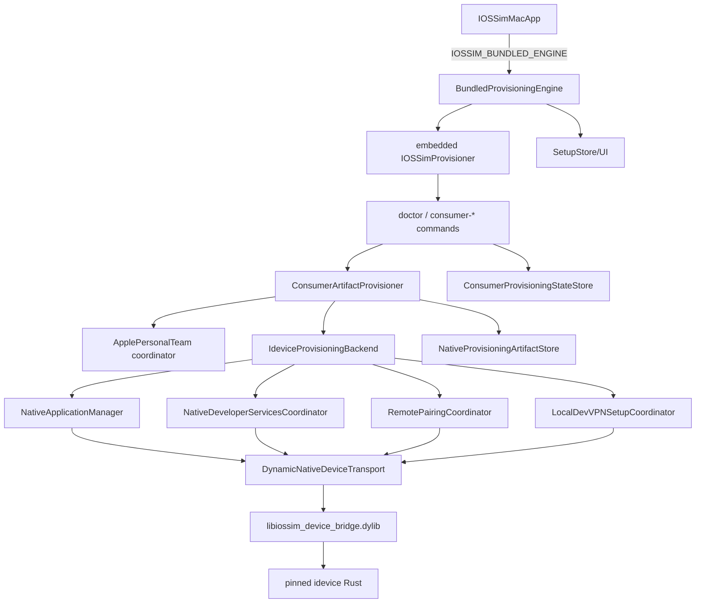

# Current call graph

## Packaged consumer graph

`doctor` is a helper subcommand: `IOSSimProvisioner doctor --json`. There is no separate doctor executable. If the embedded helper is unavailable, `UnavailableIOSSimSetupEngine.doctor()` produces a `ProcessFailure(commandName: "doctor")`; generic friendly translation can therefore say “doctor” when the actual fault is helper absence. `CONFIRMED_LOCAL_IOSSIM_CODE`

## Consumer transitions

`SetupStore` refreshes doctor/device state, gathers team/auth input, and invokes typed engine methods. `BundledProvisioningEngine` launches a new helper process for each call. The helper restores/updates the manifest, provisions/reconciles artifacts, installs them, handles developer-profile trust, mounts developer support, creates/delivers RemotePairing, starts LocalDevVPN setup, and marks the runtime checkpoint. Each helper process creates independent actors, so actor locks do not span calls or concurrent app instances. `CONFIRMED_LOCAL_IOSSIM_CODE`

## Still-reachable nonconsumer paths

| Path | Reachability | V2 disposition |
| --- | --- | --- |
| `DevelopmentCLIEngine` | Plain development compilation without bundled flag | Keep test/dev-only; compile out of public app |
| helper legacy `install`/`repair` | Direct helper CLI | Move to explicitly named developer tool or delete after parity |
| `DevicectlProvisioningBackend` | Source-level legacy backend | Remove from public target; retain only in diagnostic fixture if needed |
| `xcodebuild` | Build-time iPhone payload creation | Allowed on release builder; forbidden at customer runtime |
| repository Python `iossim` | Development CLI | Never resolved by packaged engine |
| environment bridge override | Direct helper can read `IOSSIM_DEVICE_BRIDGE_PATH` | Reject in production distribution class |

The source check `check_no_xcode_consumer_runtime.py` confirms production composition and absence of `DevelopmentCLIEngine` from the packaged branch. This is static/synthetic proof, not a clean-machine execution. `CONFIRMED_LOCAL_IOSSIM_TEST`
