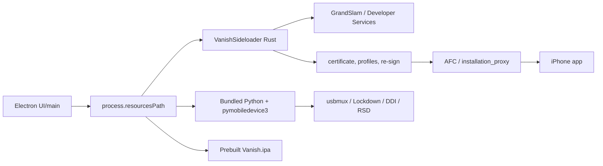

# Vanish install architecture

## Reconstructed boundary

### Confirmed

- Packaged paths resolve from Electron `process.resourcesPath`; Python, sideloader, and IPA are bundle resources. `CONFIRMED_VANISH_STATIC_CODE`
- Electron orchestrates subprocesses and progress/error mapping. `CONFIRMED_VANISH_STATIC_CODE`
- Python/pymobiledevice3 owns host device/tunnel/location helpers; `VanishSideloader` is a separate Rust executable. `CONFIRMED_VANISH_ARTIFACT`
- The shipped payload is prebuilt and intended for per-user re-sign/install; helper strings and prior clean-room analysis cover team/cert/device/App ID/profile/sign/install stages. `STRONG_INFERENCE`
- Squirrel/update-electron-app and a GitHub update channel are present. `CONFIRMED_VANISH_STATIC_CODE`
- Electron `safeStorage` is used around saved sideload-account material. `CONFIRMED_VANISH_STATIC_CODE`

### Likely

- Rust owns Apple account/provisioning/signing/installation while Python owns most device developer-service sessions. This is supported by binary strings and helper files, but not a live trace. `STRONG_INFERENCE`
- Repair reuses stored per-device/account state and can re-sign/reinstall rather than rebuilding the IPA. `STRONG_INFERENCE`

### Unknown

- Exact live Apple request sequence for every auth path; whether every credential path stays local.
- Exact update signing/rollback policy beyond the packaged updater configuration.
- Clean first-trust success and prompt ordering.
- A lawful/authoritative source for its developer-support assets. Presence of `developer_disk_image` tooling does not answer source rights.
- Whether every current iOS build uses downloaded assets, local caches, or both.

Vanish demonstrates the value of self-contained resource resolution, guided progress, and repair-specific actions. It does not prove its private protocol or asset choices are appropriate for Veya.
