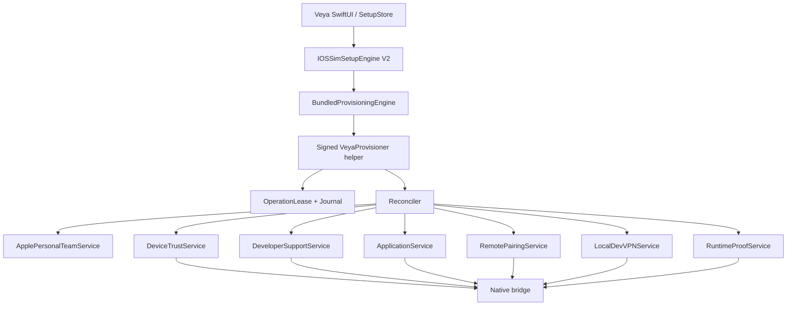

# Setup Engine V2 architecture

## Component model



The design evolves the current engine. It does not introduce a second production orchestrator.

## Command protocol

Every helper request is a length-bounded JSON envelope:

```text
schema, releaseID, operationID, generation, command,
setupKey, expectedHelperHash, cancellationToken, input
```

Every response includes the same operation/setup identity, resulting generation, status, stable code, safe user/remediation text, next required action, and typed receipts. The engine rejects mismatched IDs, schema, duplicated terminal frames, or non-JSON output. Secrets use inherited pipes or Keychain references, never argv/environment/files intended for diagnostics.

## Reconciliation loop

For each domain the helper runs `check -> decide -> repair -> verify -> commit receipt`. Checks are read-only and may run in parallel only when they cannot mutate or contend for one device service. Mutations are dependency-ordered under one cross-process lease. A failed later domain never destroys an earlier valid resource.

```text
Integrity -> Select device -> USB trust -> Apple authorization/team
 -> signing resources -> signed artifacts -> install/profile trust
 -> developer support -> AppService -> RemotePairing
 -> LocalDevVPN -> runner/TestManager -> Rich runtime proof -> READY
```

Installation can pause for user actions and resume from the committed snapshot. The helper releases the mutation lease while waiting for long human action, records a resumable nonce, and reacquires/reconciles before continuing.

## Ownership

- SetupStore owns view state, user input lifecycle, and display of typed next action.
- Helper owns mutation serialization and durable state transitions.
- Domain services own protocol checks/repairs and typed receipts.
- Stores own atomicity, schema migration, and secret/reference boundaries.
- Native bridge owns device protocol mechanics, never product state.
- Release manifest owns component identity; no component declares itself authoritative.

Production disables backend/environment selectors. Development fakes implement the same V2 protocol in memory and cannot fall through to real Apple, Keychain, device, or UserDefaults state.
