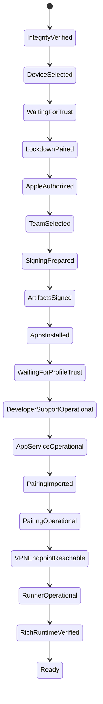

# Setup state machine

## State graph

`WaitingForTrust`, `WaitingForProfileTrust`, Apple 2FA, Developer Mode, LocalDevVPN install, and VPN approval are suspended actions rather than failures.

## State contract

The following table defines state-specific behavior. Common rules follow the table.

| State | Preconditions and input | Output/persistence | Check / repair / verify | Resume, rollback, invalidation | Primary errors |
| --- | --- | --- | --- | --- | --- |
| `INTEGRITY_VERIFIED` | Installed app path, signed release manifest | component digests/schema receipt | hash, signature, path containment, protocol handshake; repair is reinstall only | resume rechecks each launch; never mutate on failure; invalidated by bundle change | `VEYA-INTEGRITY-001..004`, `VEYA-UPDATE-001` |
| `DEVICE_SELECTED` | eligible usbmux inventory and explicit/sole selection | device hash, mux connection ID/type, product/build | inspect exact handle; repair asks reconnect/unlock/select | rollback none; invalidated by disconnect, handle or build change | `VEYA-DEVICE-001..006` |
| `WAITING_FOR_TRUST` | USB device, no valid Lockdown record | pending pairing operation nonce | call `pair_once`; classify pending dialog/passcode/denial | resume bounded polling after user action; cancellation leaves old record | `VEYA-TRUST-001..005` |
| `LOCKDOWN_PAIRED` | returned pair record | usbmux record ref/fingerprint, validated session receipt | save record then open Lockdown session on exact handle | failed validation removes only new invalid record; invalidated by host/device trust reset | `VEYA-TRUST-006..009` |
| `APPLE_AUTHORIZED` | credentials in ephemeral input or valid Keychain session | opaque session ref, expiry, adapter version | validate session; repair auth/SRP/2FA | cancellation discards ephemeral secrets; session expiry returns here | `VEYA-APPLE-001..010` |
| `TEAM_SELECTED` | authorized session, team list | team ID and type | exact selection; repair user choice | invalidated if team disappears/ambiguous | `VEYA-APPLE-011..013` |
| `SIGNING_PREPARED` | team/device/bundle set | key tag, cert fingerprint/expiry, registration/App ID refs | read-before-create, cert-key match, device/App IDs | retain old identity until replacement proves; limits do not auto-delete | `VEYA-SIGNING-*`, `VEYA-APPLE-020..024` |
| `ARTIFACTS_SIGNED` | payload manifest, valid profiles, identity | content-addressed signed artifact receipts | profile/entitlement/hash/codesign strict verify | temp outputs removed on cancel; old installed apps untouched | `VEYA-PROFILE-*`, `VEYA-SIGNING-010..015` |
| `APPS_INSTALLED` | signed main/runner, trusted device | installed bundle/version/hash inventory | install/upgrade then exact inventory; repair per component | rollback retains prior working version where device allows; invalidated by uninstall/version drift | `VEYA-INSTALL-*` |
| `WAITING_FOR_PROFILE_TRUST` | install rejection explicitly proves untrusted developer | action nonce and expected team/profile | poll launch/readiness only after user Settings action | no reinstall loop; timeout suspends | `VEYA-PROFILE-010..012` |
| `DEVELOPER_SUPPORT_OPERATIONAL` | Developer Mode, exact support assets | asset provenance/digests, mount/TSS receipt, RSD identity | exact BuildIdentity, personalize, mount, requery services | preserve prior cache; invalidate on build/device/asset mismatch | `VEYA-DEVSERVICE-001..012` |
| `APPSERVICE_OPERATIONAL` | RSD service map and installed apps | service/feature receipt | connect AppService and launch exact main bundle | retry tunnel once after reconcile; never call manual launch proof | `VEYA-DEVSERVICE-020..026` |
| `PAIRING_IMPORTED` | request-bound bootstrap and encrypted candidate | candidate public fingerprint + import receipt | House Arrest transfer, AEAD context check, phone staging import | old active pair remains; expired candidate deleted | `VEYA-PAIRING-001..012` |
| `PAIRING_OPERATIONAL` | imported candidate | possession and authenticated RSD proof receipts | fresh challenge/pair-verify from selected phone, then developer-service connection | promote atomically; on failure delete candidate only | `VEYA-PAIRING-020..028` |
| `VPN_ENDPOINT_REACHABLE` | supported LocalDevVPN installed, user VPN approval | app version/config status and reachability receipt | scene-activated request, launch, endpoint challenge | stop retry on permission denial; invalidate on app/version/path change | `VEYA-VPN-001..012` |
| `RUNNER_OPERATIONAL` | runner installed/mapped, RSD and VPN | launch PID/session/TestManager attach receipt | AppService launch and TestManager handshake | repair mapping/install/session, not Apple identity by default | `VEYA-RUNNER-001..012` |
| `RICH_RUNTIME_VERIFIED` | runner session | generation-bound proof receipt | bounded Rich set/observe/clear or safe no-op contract; confirm writer and clear | cancel sends clear and records pending clear if disconnected | `VEYA-RUNTIME-001..012` |
| `READY` | all live receipts current and identities equal | readiness timestamp/TTL and dependency digest | quick live health on foreground; full proof after invalidation | any invalid domain returns to earliest owning state | domain code or `VEYA-STATE-*` |

## Common execution rules

- **Owner:** the helper is transition owner; domain service produces the receipt; store commits it.
- **Retry:** transient network/device failures use capped exponential backoff with jitter and server `Retry-After`; user denials, limits, integrity, protocol incompatibility, and wrong identity never auto-retry.
- **Timeout:** protocol calls have short bounded timeouts; DDI upload/install have progress-aware long bounds; human actions suspend with an expiry rather than hold a process lock.
- **Cancellation:** checked before mutation, between protocol phases, and before commit. Non-interruptible device writes finish safely, then reconcile; runtime cancellation prioritizes Clear.
- **Rollback:** means preserve last known-good resource and remove only unpromoted candidates. It never deletes an active pairing, installed working app, valid certificate, or Keychain key merely because the next step failed.
- **Invalidation:** each receipt lists its input digest. Release, device build/handle, team, artifact, profile, DDI, app version, pairing fingerprint, VPN version, or runner generation changes invalidate dependent receipts transitively.
