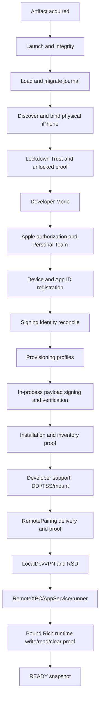

# End-to-end installation state machine

## Verdict

Veya does not currently have one installation state machine. It has at least four overlapping representations:

1. `SetupPhase` and `SetupStore` drive UI flow.
2. `ConsumerProvisioningStage` and `ConsumerProvisioningManifest` drive provisioning and checkpoints.
3. `IOSSimSetupEngine` / `KeyedSetupStateStore` maintain leases and setup journal state.
4. Apple identity diagnostics maintain a separate generation/checkpoint stream.

`ConsumerOnboardingCoordinator` and the test-local `HermeticInstallationEngine` add two more conceptual flows. `SetupStore` can enter Apple/profile preparation through `runLiveProvisioningThroughProfiles` and the broader packaged flow through `runProvisioningBody`. This duplication makes ordering, interruption, and READY semantics difficult to prove.

The target must be one production reconciliation engine. UI state, CLI commands, diagnostics, and tests must be projections or drivers of that engine, never independent state machines.

## Canonical product sequence



The current implementation sometimes prepares profiles before the full physical-device reconciliation and sometimes reuses cached native artifacts. The target sequence above is dependency order, not a mandate to redo already-proven stages. Reconciliation skips a stage only after re-proving its postcondition.

## State contract

Every state below has a corresponding complete record in `installation_state_machine.json`. Compact notation in the table is:

- **Proof**: authoritative success evidence.
- **Persist**: durable, nonsecret state.
- **Retry/resume**: bounded retry and restart rule.
- **Tests**: `P` pure, `H` hermetic external API, `K` isolated Keychain, `S` actual signer, `D` non-destructive device, `F` physical/destructive-or-Apple-controlled.

| State | Owner and operation | Inputs / preconditions / dependency | Proof and persistence | Retry, interruption, stale/reinstall/upgrade | Failure / user interaction / tests |
| --- | --- | --- | --- | --- | --- |
| `ARTIFACT_ACQUIRED` | release scripts + `PackagedEngineIntegrity`; identify mounted bytes | DMG/app, release manifest; macOS/Gatekeeper | mounted app hash, architectures, nested signature/integrity manifest; persist artifact ID | no blind retry; restart inspection; upgrade compares schemas/hashes | integrity/update failure; Gatekeeper is legitimate; P,H, packaged physical |
| `MAC_LAUNCHED` | `IOSSimMacApp`, `BundledProvisioningEngine`; launch exact packaged helper | valid artifact; macOS 13+ target | helper protocol handshake and executable digest, not process exit alone | relaunch-safe; reject partial/mismatched helper | packaging/architecture/integrity; Gatekeeper may require user; H, packaged, clean Mac |
| `STATE_RECONCILED` | target InstallationEngine, currently `SetupStore` + stores; migrate and reconcile | artifact identity and all state roots | schema-valid journal plus observed domain snapshot | atomic transaction; corrupt/stale state quarantined; reinstall discovers existing resources | state/migration; no destructive user action; P,H, reinstall physical |
| `DEVICE_BOUND` | `NativeDeviceBridge`; discover and select one physical device | usbmux/CoreDevice visibility | stable selected physical UDID alias plus connection evidence | poll bounded; resume exact device; never silently switch | no/multiple/disconnected device; connect/select user action; P,D,F |
| `TRUST_READY` | `NativeLockdownPairingCoordinator`; Lockdown pair/validate | selected device connected, unlocked | Lockdown validation receipt for selected device | retry only pending/locked/disconnected; revalidate after reboot | Trust/passcode/locked/denied; Apple UI is legitimate; H,D,F |
| `DEVELOPER_MODE_READY` | native inspection + setup UI | trusted supported iPhone | live Developer Mode status | recheck after required reboot; cached value is not proof | mode off/unknown/unsupported; user enables/reboots/confirms; H,D,F |
| `APPLE_SESSION_READY` | `ApplePersonalTeamLive`; GrandSlam/SRP/2FA/session validation | network, credentials only when needed | live team discovery using session; opaque session stored in Veya auth Keychain | bounded transport retry; expired session reauth; never persist password by default | credentials/2FA/outage/protocol; Apple auth/2FA user action; P,H,K,F |
| `PERSONAL_TEAM_READY` | `ApplePersonalTeamLive`; select team | valid session, team listing | selected team returned by Apple and tied to generation | re-list on resume/account change; reject stale team | no/ambiguous team; selection only if genuine ambiguity; P,H,F |
| `DEVICE_REGISTERED` | `ApplePersonalTeamLive.registerDevice`; read-before-create | team, physical UDID, device name | Apple device inventory contains exact UDID/team | relist after ambiguous response; no deletion on quota | API/quota/team mismatch; normally none; P,H,F |
| `APP_IDS_READY` | Apple service; list/create derived IDs | team, stable Veya bundle derivation | Apple inventory contains exact identifiers/features | read-before-create; conflict is classified; migration retains legacy IDs | quota/collision/team mismatch; no portal jargon; P,H,F |
| `SIGNING_KEY_READY` | target SigningIdentityStore; generate/load Veya key material | team and installation ID | cryptographic sign/verify with public-key fingerprint; no `codesign`/ACL dependency | candidate transaction; resume key generation; quarantine corrupt blob | key store unavailable/corrupt/missing; no SecurityAgent prompt; P,H,K,S |
| `CERTIFICATE_READY` | Apple certificate service; match/reuse/issue/recover | key public key, team, Apple inventory | cert public key matches key; valid dates/team/serial; actual signature verifies | bounded 7460 reconcile; only revoke ownership-proven inactive cert; multi-Mac fails safe | capacity/revocation/API/expiry; user sees actionable account constraint only; P,H,S,F |
| `PROFILES_READY` | Apple profile service; create/download/validate main+runner | device, App IDs, certificate | decoded profile matches team, cert, UDID, bundle, entitlements, expiry | regenerate stale/expired/mismatched candidate; active install preserved | profile/API/mismatch/expiry; normally none; P,H,S,F |
| `PAYLOAD_SIGNED` | target in-process signer; rewrite IDs, embed profiles, sign nested-to-root | immutable source apps, profiles, key/cert, entitlements | independent signature/entitlement/profile verification on output bytes | temp workspace is disposable; restart sign; never trust partial output | nested/main/runner/signature mismatch; none; P,S, packaged |
| `APPS_INSTALLED` | `NativeApplicationManagement`; AFC staging + InstallationProxy | exact signed apps, selected trusted device | authoritative installed-app inventory has exact IDs/team/version/digest where available | relist after interruption; upgrade in place; never uninstall unknown ownership | upload/install/inventory/profile trust; profile Trust may be required; H,D,F |
| `PROFILE_TRUST_READY` | AppService launch probe / device UI | installed dev-signed app | successful launch or explicit trusted status | recheck after user action; do not reinstall to solve trust | developer-profile Trust; user acts in Settings; D,F |
| `DEVELOPER_SUPPORT_READY` | `DeveloperSupportCoordinator`, native bridge; select DDI, personalize TSS, mount | OS/build, Developer Mode, network/cache | exact-build image signature, personalization receipt, live mount/developer-service probe | cached exact image reusable; interrupted candidate discarded; re-mount after reboot | source unavailable/TSS/mount/unsupported build; user only handles Developer Mode; H,D,F |
| `PAIRING_READY` | `RemotePairingCoordinator`; create/reuse/deliver/receipt/possession proof | developer services, selected device, installed app | device-bound receipt plus developer-service possession proof | active/candidate; repair only invalid record; preserve prior active on failure | creation/delivery/receipt/proof; Trust may reappear; P,H,D,F |
| `VPN_READY` | `LocalDevVPNSetupCoordinator`; discover/install/launch/approval/readiness | phone app, pairing, external LocalDevVPN availability | live tunnel endpoint bound to device/pairing generation | relaunch and poll bounded; after reboot re-prove; never cache READY indefinitely | app missing/approval/tunnel; App Store and VPN approval are legitimate; P,H,D,F |
| `RSD_READY` | native bridge; CoreDevice proxy/tunnel/RSD discovery | VPN/software tunnel, pairing | selected-device RSD service identity reachable | rediscover after tunnel/iPhone/Mac reboot; reject identity change | transport/RSD/protocol; usually none; H,D,F |
| `APPSERVICE_READY` | `NativeDeveloperServicesCoordinator`; RemoteXPC/AppService | RSD, developer support | exact main/runner inventory and bounded launch succeeds | reconnect/relaunch; installation state retained | RemoteXPC/AppService/launch; profile Trust may be needed; H,D,F |
| `RICH_RUNTIME_READY` | `RichRuntimeReadiness`; runner/TestManager/XCTest and write/read/clear | AppService, runner mapping, pairing, VPN | fresh device-bound receipt proving bounded Rich location write, observed effect, and clear | rerun proof after generation/device/profile/runtime changes; no replay of old user intent | runner/TestManager/runtime proof; none beyond phone availability; P,H,D,F |
| `READY` | target reconciliation engine; derive domain snapshot | every mandatory domain freshly `READY` for same device/generation | conjunction of live proofs plus expiry windows; never a lone cached flag | on reopen reconcile cheapest invalid domain; refresh before expiry; downgrade immediately on contradiction | first non-ready domain; only domain-specific user action; P,H,D,F |

## Current-to-target correction

The actual implementation has a successful Sep 15 event stream through installation, DDI, RSD, RemoteXPC, AppService, pairing, LocalDevVPN, and `SETUP_READY_FOR_RUNTIME`. That observation proves the components can interoperate on this development Mac; it does not prove first install, packaged clean-Mac behavior, or current Build 11. Xcode and extensive prior IOSSim/Veya state were present.

READY must therefore be derived as:

```text
READY(device, generation) =
  artifact current
  AND state schema current
  AND exact device reachable, trusted, unlocked enough for the probe
  AND Developer Mode ready
  AND Apple signing material valid beyond policy window
  AND exact installed artifacts current
  AND developer support live
  AND pairing possession live
  AND VPN/RSD live
  AND AppService/runner live
  AND fresh bound Rich runtime proof succeeds
```

Persisted state may tell reconciliation what to inspect; it may not establish any live conjunct by itself.

