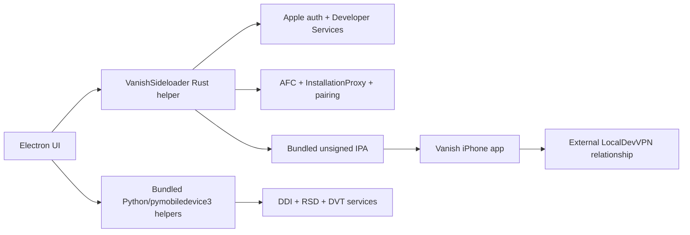

# Vanish installation architecture

## Evidence policy

Labels in this document are exact:

- **OBSERVED**: static fact or readable call path in the inspected Vanish 3.2.1 DMG/binary/ASAR/IPA. No live Vanish install was executed.
- **VERIFIED_FROM_OPEN_SOURCE**: behavior in preserved public isideload/iLoader source. It is reference behavior, not proof Vanish uses the same revision or policy.
- **INFERRED**: likely Vanish behavior from observed binary provenance/capability plus matching public source.
- **UNKNOWN**: not established.

## Packaged architecture

- **OBSERVED**: `VanishSetup.dmg` contains signed/notarized `Vanish.app` 3.2.1, an arm64 Electron app, `VanishSideloader`, bundled Python 3.13/pymobiledevice3 9.12.0, developer-image support, mobile IPAs, and Squirrel update components.
- **OBSERVED**: no dedicated privileged helper, launch agent, system extension, bundled Apple CoreDevice/DVT private framework, or Vanish Network Extension was found.
- **OBSERVED**: Electron resolves resources inside the app bundle and invokes native/Python helpers through explicit commands. This packages the toolchain rather than requiring Xcode or a repo checkout.
- **OBSERVED**: Vanish's current inspected artifact is arm64, so it is not evidence for Intel support.

## Consumer flow

| Area | Finding | Classification |
| --- | --- | --- |
| first launch/install | signed/notarized app in DMG; Squirrel updater present | OBSERVED |
| helper lifecycle | JSON command/event bridge includes login, 2FA, max-certs response, selection, install, pairing, progress and helper loss | OBSERVED |
| Apple authentication | GrandSlam/SRP, trusted-device and SMS 2FA vocabulary/capability in helper | OBSERVED capability; live sequence UNKNOWN |
| password persistence | optional Electron `safeStorage` record in `sideload_accounts.json`; failed decrypt removes unusable record | OBSERVED |
| Personal Team/provisioning | team, certificate, device, App ID, profile, signing and install operations present | OBSERVED capability; exact runtime policy INFERRED |
| payload | bundled IPA lacks embedded profile and is consistent with per-user resigning | OBSERVED |
| device install | AFC staging and InstallationProxy capability, with install dispatch to bundled IPA | OBSERVED/INFERRED |
| Trust/Developer Mode | intended flow exposes lock/Trust/Developer Mode errors; bypass is not evidenced | OBSERVED static behavior |
| DDI/developer services | bundled pymobiledevice3/developer_disk_image and Python call paths implement discovery, mounting, RSD and DVT location | OBSERVED |
| pairing | creation, selection, placement, receipt files, repair and manual export fallback | OBSERVED |
| VPN | mobile strings and URL relationship show external LocalDevVPN setup/approval | OBSERVED relationship; acquisition/ownership UNKNOWN |
| recovery | helper watchdog, up to three restarts, two-second retry delay, RSD identity guard and scoped repair paths | OBSERVED code paths |
| refresh | phone-side self-refresh/re-sign machinery and seven-day messaging exist | OBSERVED/strong static evidence; success rate UNKNOWN |
| reinstall/update | Squirrel update cleanup exists; exact state migration and clean reinstall behavior | OBSERVED mechanism / UNKNOWN result |
| multi-Mac | no evidence | UNKNOWN |

## What Vanish actually simplifies

Vanish's consumer advantage is primarily component packaging and orchestration. It owns helper discovery, Apple setup, signing, install, developer support, pairing placement, VPN handoff, recovery messaging, and refresh as product operations. It does not prove that Apple Trust, passcode, Developer Mode, profile trust, credentials, 2FA, VPN approval, or seven-day Personal Team expiry can be eliminated.

## Call-path reconstruction

The readable Electron layer launches `VanishSideloader` with an app-owned data directory and sends line-delimited commands. Install has long timeouts because it may include login, signing, upload, device selection, and certificate-limit interaction. Python helpers separately own RemotePairing, wireless discovery/tunnel, DDI and DVT location streaming. The observed separation matters: signing/provisioning and developer-service transport are independently stageable.

## Restart, reinstall, stale state and multiple Macs

- **OBSERVED**: helper restart and pairing repair are distinct operations; updater cleanup exists.
- **INFERRED**: app-owned data plus stored account/key material allows some restart/reinstall reuse.
- **UNKNOWN**: whether deleting Vanish preserves or removes key material; how corrupt metadata is repaired; whether profiles/certs are reused; behavior when the same Apple ID is used on two Macs; whether an update migrates every persisted schema.

Veya must not turn these unknowns into borrowed requirements. The useful reference is the separation of operations and reduced dependence on macOS signing identities, not an assumed Vanish recovery policy.

