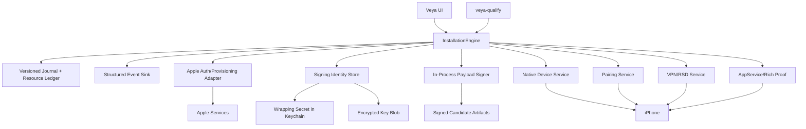

# Target installation architecture

## Design

Veya becomes a reconciliation system, not a wizard that assumes every prior step succeeded. One `InstallationEngine` owns state, transitions, repair planning and READY. The Mac UI and `veya-qualify` send intents and render engine events. Domain services perform narrow operations and return proof or typed failure.



## Ownership boundaries

| Component | Owns | Must not own |
| --- | --- | --- |
| `InstallationEngine` | state transitions, generation, intent, resume, repair plan, READY derivation | protocol details, UI copy, raw secrets |
| `InstallationJournal` | atomic active/candidate ledger, irreversible intents, domain proofs/expiry | claiming live readiness from stored data |
| `AppleAuthorizationService` | SRP/2FA/session validation | certificates, UI flow state |
| `AppleResourceService` | team, device, App IDs, cert/profile APIs and typed responses | private-key storage, arbitrary revoke policy |
| `SigningIdentityStore` | encrypted key blob, wrapping key, fingerprints, active/candidate identity records | Apple API calls, payload traversal |
| `CertificateReconciler` | public-key matching, ownership classification, 7460 recovery, exact revoke intent | broad account cleanup |
| `PayloadSigner` | ID/profile/entitlement preparation, nested-to-root signing, signed manifest | Keychain search lists, SecIdentity, `/usr/bin/codesign` execution |
| `NativeDeviceService` | discovery, selected identity, Lockdown, AFC, InstallationProxy, DDI/TSS/mount | implicit device selection, Apple account state |
| `PairingService` | active/candidate RemotePairing lifecycle and proof | generic setup readiness |
| `VPNRSDService` | LocalDevVPN handoff, approval/readiness, tunnel and exact-device RSD | profile/signing repair |
| `RuntimeService` | RemoteXPC/AppService, runner and bound Rich proof/clear | persisting user movement intent as setup state |
| `OperationEventSink` | safe event envelope and run correlation | raw request/response or secret dumps |

## State and persistence

Use one versioned journal keyed by `(installationID, safeDeviceIdentity, teamID, releaseChannel)`. It records active/candidate resource references and per-domain proof metadata. Large/sensitive blobs live in domain stores and are referenced by opaque IDs. Every mutation follows:

```text
observe -> plan -> persist intent -> mutate -> observe authoritative result
-> persist proof -> promote candidate -> retire old reference
```

Leases prevent concurrent mutation. Crash recovery reconciles the persisted intent before issuing a second external mutation. State paths are injectable so tests can run entirely under repo-contained isolated roots.

## Apple authentication and provisioning

Keep the existing native GrandSlam/SRP/2FA work behind a versioned adapter and allowlisted endpoints. Password and 2FA remain ephemeral. Opaque valid session material uses a Veya-owned authorization Keychain with a real packaged-process reuse test. Team/device/App ID/profile operations retain read-before-create, strict response validation and exact device/team continuity.

## Signing and certificates

Generate RSA-2048 key material through the target signer/key library and store versioned PKCS#8 encrypted at rest. Reconstruct an in-memory signer per operation. Match certificates by public key and validate team/date/serial. On 7460, relist and classify:

```text
ACTIVE_USABLE
VEYA_THIS_INSTALL_ACTIVE_OR_CANDIDATE
VEYA_THIS_INSTALL_INACTIVE_RECLAIMABLE
VEYA_OTHER_INSTALL
UNKNOWN
```

Only the inactive reclaimable class can be revoked, and only when issuance is blocked. Persist the exact serial intent before the call; reconcile after crashes; retry the identical CSR bounded. Profiles bind certificate, team, device, bundle and entitlements. Sign from immutable source into a candidate directory; independently verify all code objects.

## Device and runtime

Bind one physical device at the start and carry its identity through every request. Trust, unlock and Developer Mode are user-action states. Installation uses AFC/InstallationProxy and authoritative inventory after any ambiguous response. DDI source/build/signature and TSS receipt are explicit proofs. Pairing, VPN/RSD, AppService and Rich runtime each have independent readiness/repair domains. A phone or Mac reboot invalidates volatile proofs but not durable signing/install state.

## Reinstall, migration and upgrade

Reinstall begins with inventory, never cleanup. Legacy IOSSim data is imported once, cryptographically or live-service validated, and retained for rollback. The new signing identity is a candidate and no legacy ACL repair is attempted. Upgrade signs/installs the new candidate in place, verifies inventory and Rich runtime, then promotes. Unknown apps, keys, certificates and pairing records are never removed.

## Security

- Least-privilege service interfaces and no shell secret arguments.
- No global Keychain search-list mutation in target architecture.
- Authenticated encryption and bounded parsing for key/state blobs.
- Exact selected-device/team binding on every mutation.
- Persisted intent before revocation or other irreversible calls.
- Allowlist-only diagnostic fields and mandatory report secret scan.
- Pinned dependencies, SBOM/license review and signer-library security review.

## Testing and diagnostics

All layers drive this production engine. Fixture adapters simulate Apple/device systems; secure-store and signer tests exercise real implementations; live commands select exact devices. Each operation emits start/end envelopes, so the first failure is directly observable. The release script consumes a signed qualification run manifest and refuses to package a candidate when lower gates are missing or stale.

## READY

READY is derived, device-bound, generation-bound and time-bounded. Reopening Veya rechecks volatile domains and expiration windows. A contradictory observation immediately downgrades the affected domain and selects the smallest repair. Cached setup state can accelerate inspection; it cannot assert capability.

