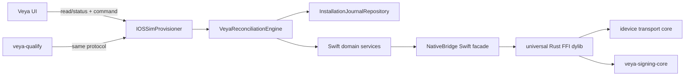

# Final Module Architecture

## Ownership rule

`VeyaReconciliationEngine` is the only product setup orchestrator. Domain services observe and perform one bounded operation; they never advance product stages themselves. `IOSSimProvisioner` is the only packaged mutating executor. The UI and `veya-qualify` are clients of that executor.

| Module | Responsibility and interface | State / transaction | Current -> target | Tests |
|---|---|---|---|---|
| ArtifactRelease | Verify bundle, helper, Rust bridge, schemas, payload inputs | Immutable artifact evidence | `PackagedEngineIntegrity`, scripts: keep/extend | Mounted-byte and architecture tests |
| Reconciliation | Observe, derive desired state, plan one transition, execute, re-observe | Owns generation/lease; writes journal through repository | `SetupStore` + coordinator + helper branching: replace | Exhaustive transition/model tests |
| AppleAuthorization | Establish/reuse/invalidate Apple session; 2FA challenge | Keychain session record only | Experimental/live auth: split and retain parser/SRP | Hermetic transport + real noninteractive Keychain |
| PersonalTeam | Discover team and register selected device | No independent source of truth | Apple live backend: narrow | Fixture/API contract tests |
| SigningKeyStore | Generate, wrap, unwrap, match, rotate RSA key material | Encrypted PKCS#8 candidate/active artifacts | `VeyaSigningKeychain`: replace | Real isolated data-protection Keychain tests |
| InProcessSigner | Sign/verify exact staged iOS bundle | Staging directory only | `codesign` payload path: replace | Golden bundles + independent verification |
| CertificateReconciler | Match key to Apple inventory; issue/revoke safely | Journal evidence and immutable DER | Capacity logic: retain algorithm, change ownership | 7460/ownership scenario matrix |
| ProfileService | App ID and profile issue/validation | Candidate profile artifact | Live provisioning: split | Expiry/device/team/entitlement fixtures |
| PayloadBuilder | Copy immutable source into candidate staging | Candidate directory | Artifact provisioner: split | Deterministic manifest tests |
| DeviceTransport | One Swift abstraction over one Rust ABI | Device connection generation only | Native bridge: keep and modularize | ABI/transport/physical safe probes |
| ApplicationInstaller | Install, inventory, launch candidate | Install receipt/evidence | Native application management: keep/narrow | Fake + physical InstallationProxy |
| DeveloperSupport | Exact-build DDI lookup, personalize, mount, prove | Validated cache + evidence | Existing coordinator/provider: keep/split policy | Provider and safe mount-status tests |
| RemotePairing | Candidate delivery/import/possession proof/promotion | Encrypted candidate/active record | Existing lifecycle: keep, journal integration | Replay/wrong-device/crash tests |
| LocalDevVPN | Observe approval/config/running/endpoint | Phone-owned state; evidence only on Mac | Existing coordinator: keep, strengthen states | Inbox/receipt/restart tests |
| RuntimeReadiness | Live tunnel through bounded Rich proof | Fresh expiring evidence | Existing rich readiness: retain/narrow | Wrong-target/stale-runner/cleanup tests |
| Migration | Read legacy IOSSim/Veya state once | Migration ledger in journal | ProductBrand readers: consolidate | Every partial migration boundary |
| Diagnostics | Stable events/errors, support export/redaction | Append-only JSONL + evidence refs | `VeyaDiagnostics`: extend | schema/redaction/first-failure tests |
| Qualification | Drive production engine with policy-limited commands | Separate run report, never product truth | Python script/test-local engine: replace | CLI contract/scenario tests |

## Contract detail

| Name | Inputs -> outputs | Owned state | Dependencies / error model | Transaction and migration |
|---|---|---|---|---|
| ArtifactRelease | app URL/release manifest -> verified artifact evidence | none | filesystem, code-signature/hash; ART errors | immutable read; extend current integrity |
| Reconciliation | snapshot/desired/policy -> plan/outcome | run lease/generation | every observer/transition; STATE + domain failures | one transition per journal checkpoint; replaces coordinators |
| Journal | mutations/evidence -> durable snapshot | active/candidate/migration ledger | APFS/filesystem; STATE failures | atomic whole-document writes; imports current stores |
| AppleAuthorization | account hint/ephemeral challenge -> validated session ref | Keychain session item | Apple transport/Keychain; AUTH | candidate session promote; legacy service read once |
| PersonalTeam | session/device -> team/registration receipt | none | Apple API; TEAM | idempotent server mutation; reuse parsers |
| SigningKeyStore | generation -> key descriptor/closure-scoped PKCS#8 | encrypted key + wrap item | Keychain/filesystem/crypto; KEY | candidate prove/promote; import legacy if safe |
| InProcessSigner | bundle/key/cert/profiles/policy -> signing receipt | staging only | Rust signing core; SIGN | never active/source in place; replaces codesign |
| CertificateReconciler | keys/inventory/capacity -> reuse/issue/revoke plan | journal resource record | Apple cert API; CERT | bounded candidate lifecycle; retains capacity parser |
| ProfileService | team/app/device/cert -> validated profile | candidate artifact | Apple profile API/CMS; PROFILE | atomic artifact promotion; split live backend |
| PayloadBuilder | immutable source/manifest -> staged graph | candidate tree | filesystem/artifact verifier; INSTALL | same-volume staging; split provisioner |
| DeviceTransport | device ID/operation -> typed receipt | connection handle/generation | Rust bridge; DEVICE | per-operation; consolidate duplicate callers |
| ApplicationInstaller | staged app/device -> inventory/launch receipts | none | DeviceTransport; INSTALL | ambiguous-result observation; retain primitives |
| DeveloperSupport | OS build/device -> service proof | validated content cache | provider/TSS/transport; DDI | quarantine/promote/mount; split dev/prod provider |
| RemotePairing | device/payload/candidate -> possession proof | Keychain pairing reference | transport/phone inbox; PAIR | active/candidate; migrate service names |
| LocalDevVPN | device/config -> endpoint proof | phone configuration; Mac evidence | app transport/endpoint; VPN | preserve working config; strengthen states |
| RuntimeReadiness | all live prerequisites -> expiring evidence | evidence reference only | transport/pair/VPN/Rich; RUNTIME | no durable READY; adapt current coordinator |
| Migration | legacy inventory -> item ledger/import candidates | migration ledger | read-only legacy adapters; MIG | one-way, no indefinite dual write |
| Diagnostics | typed events -> redacted event/support report | append-only events | all modules; SEC on leakage | event after journal; extend diagnostics |
| Qualification | command/capability -> report/exit code | qualification report | provisioner protocol; any domain code | never product state; replace separate harness |

## Process and language boundaries

- Swift owns orchestration, journal, Keychain APIs, Apple API policy, UI-facing failures, and filesystem transactions.
- `veya-signing-core` owns bundle discovery, Mach-O/CMS signing, and signature verification.
- Existing `iossim-device-bridge` owns FFI allocation/status and device transport. It depends on signing-core but signing-core never depends on device transport.
- iOS payload owns pairing/VPN/runtime inboxes and proof generation; it never owns Mac reconciliation state.

## Compatibility and deletion

- `SetupStore` survives as a presentation adapter, not an engine.
- `BundledProvisioningEngine` becomes a typed provisioner client.
- Apple request/response parsing, capacity parsing, native transport, DDI, pairing, VPN, and Rich proof logic survive behind narrower protocols.
- `ConsumerOnboardingCoordinator`, `HermeticInstallationEngine`, duplicate manifests/journals, SecIdentity resolver, ACL repair, signing Keychain, and payload `/usr/bin/codesign` are removed after migration gates.
- Legacy readers remain migration-only and are forbidden from writes after migration version 1 completes.
