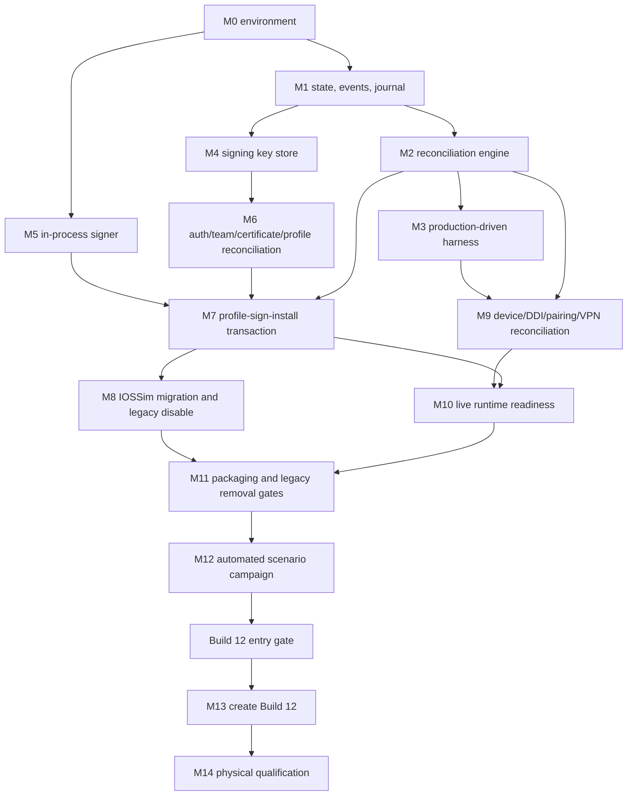

# Implementation Dependency Graph

Topological order: M0; M1; M2; M3 and M4/M5 may proceed in parallel; M6; M7; M8 and M9; M10; M11; M12; gate; M13; M14.

The signer does not depend on Apple APIs. Certificate reconciliation depends on the key-store public interface but not signing implementation. Device reconciliation does not depend on certificate internals. Runtime needs both installed candidate identity and device/VPN/pairing proof. Legacy deletion waits for migration plus packaged runtime proof.

