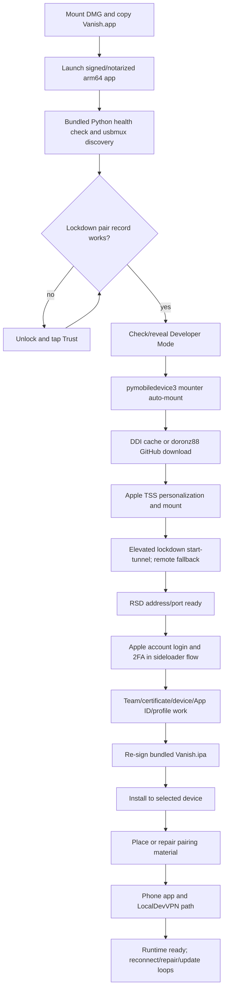

# Vanish consumer setup flow

This sequence is reconstructed from the official `VanishSetup.dmg` without executing vendor code. UI wording is inferred only where renderer/main-process messages expose it.

| Step | Consumer experience | Owner | Source/state | Recovery and no-Xcode relevance | Confidence |
| --- | --- | --- | --- | --- | --- |
| DMG/app | Download, drag to Applications, launch | macOS + Electron bundle | Signed app bundle | Gatekeeper/notarization supplies normal Mac trust; all tools resolve under `process.resourcesPath` | `CONFIRMED_VANISH_ARTIFACT`, `CONFIRMED_VANISH_STATIC_CODE` |
| Device discovery | Plug in iPhone; app detects it | bundled Python/PMD/usbmux | live usbmux; wireless profile JSON for optional reuse | polling/reconnect; avoids Xcode/CoreDevice command dependencies | `CONFIRMED_VANISH_STATIC_CODE` |
| Computer trust | Unlock and tap Trust when prompted | Lockdown through PMD/Rust helper | system pair record and helper data directory | explicit VAN-110/VAN-111 guidance; select/repair commands allow 180 seconds | `CONFIRMED_VANISH_STATIC_CODE`; precise initial-pair owner is `STRONG_INFERENCE` |
| Developer Mode | Turn it on and reboot/confirm | PMD + phone Settings | phone state | reveal helper and VAN-112/121; user consent preserved | `CONFIRMED_VANISH_STATIC_CODE` |
| Developer support | Stay online/unlocked while Apple setup completes | bundled PMD and `developer_disk_image` | `~/Xcode_iOS_DDI_Personalized` cache | retry locked/trust cases; generic mount/personalization errors mapped to VAN-113/120 | `CONFIRMED_VANISH_STATIC_CODE` |
| Tunnel/RSD | Mac password prompt may appear; connection becomes ready | Electron orchestration + bundled Python PMD | temp pid/log files; in-memory RSD endpoint | elevated `lockdown start-tunnel`, `remote start-tunnel` fallback, bounded retries and reconnect | `CONFIRMED_VANISH_STATIC_CODE` |
| Apple provisioning | Enter Apple ID/password, 2FA, possibly choose certificates | Rust `VanishSideloader` with Electron IPC | sideloader data dir; optional safeStorage credential blob | typed command timeouts and error namespace; removes manual Xcode signing | `CONFIRMED_VANISH_STATIC_CODE`; internals beyond observable protocol are `STRONG_INFERENCE` |
| Payload | App prepares supplied `Vanish.ipa` | Rust sideloader/device stack | bundled IPA plus temporary signed output | `install_sidestore` has a 15-minute budget; failures are retryable | `CONFIRMED_VANISH_ARTIFACT`, `CONFIRMED_VANISH_STATIC_CODE` |
| Pairing placement | Setup or Repair Pairing | Rust helper + app container access | sideloader data and selected installed pairing app | `place_pairing` and `repair_pairing`; repair can re-derive after a Trust prompt | `CONFIRMED_VANISH_STATIC_CODE`; cryptographic semantics `UNKNOWN` |
| LocalDevVPN/runtime | Phone-side flow uses LocalDevVPN scheme/query relationship and RSD | iPhone app, LocalDevVPN, desktop tunnel | phone app state and desktop connection | reconnect and repair behaviors are visible; exact LocalDevVPN install ownership is not proven | artifact/static evidence; ownership `UNKNOWN` |
| Update | App offers downloaded desktop update | Electron autoUpdater/Squirrel | updater state | cleanup before quit/install; one packaged update path | `CONFIRMED_VANISH_STATIC_CODE` |

The DDI/tunnel preparation and sideload provisioning are separate workflows that can interleave in UI. Static evidence establishes their dependencies, not every screen transition. Vanish's `auto-connect-ready` proves an RSD endpoint after DDI/tunnel setup; it does not by itself prove Veya's XCTest runner or Rich location semantics.

The desktop bootstrap rejects detected versions below iOS 18, while the inspected Vanish IPA declares minimum iOS 17.4. The binary/plist minimum therefore does not define the supported consumer flow; Vanish's live desktop gate does. `CONFIRMED_VANISH_STATIC_CODE`, `CONFIRMED_VANISH_ARTIFACT`
