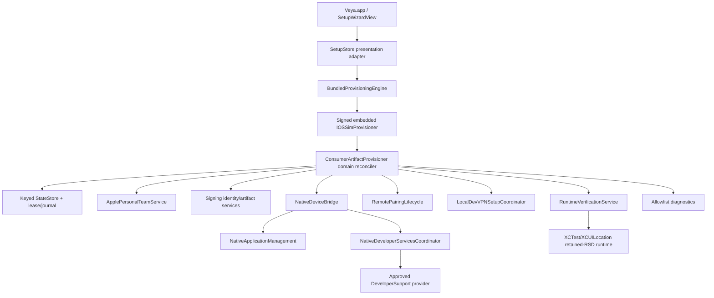

# Target Veya installation architecture

Veya uses the Vanish consumer pattern and the existing IOSSim implementation foundation.

## Boundaries

- `SetupStore` owns UI intent, progress, cancellation, and safe error presentation. It does not know Apple private protocols, files, or shell commands.
- `BundledProvisioningEngine` owns the signed helper boundary, protocol handshake, request framing, timeout, cancellation, and integrity checks.
- `IOSSimProvisioner` is the single cross-process lock owner and composition root for production services.
- `ConsumerArtifactProvisioner` becomes a domain reconciler. Each domain implements check/repair/verify and returns receipts; it does not treat persisted checkpoints as proof.
- `ApplePersonalTeamService` is stable; its versioned adapter contains GrandSlam/AuthKit/Developer Services details and a kill switch.
- `NativeDeviceBridge` remains the device authority. ABI v2 adds initial Lockdown pairing and exact connection selection.
- `DeveloperSupportService` selects only approved exact-build assets, records provenance, delegates TSS/mount to the native bridge, and verifies RSD/AppService.
- `RemotePairingLifecycle` owns candidate/active state and two-stage proof.
- `RuntimeVerificationService` starts the installed runner through the real developer-services path and proves a bounded Rich location write/acknowledgement/clear before READY.

Production contains no repo lookup, backend environment selector, `xcodebuild`, `devicectl`, Xcode-derived profile fallback, or developer Python/Node/Rust dependency. Development tools remain in development-only targets until parity gates permit deletion.
